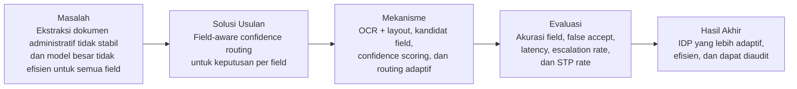
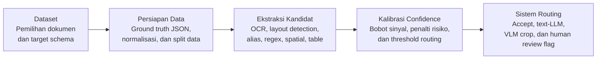

# PROPOSAL TESIS

## Rancang Bangun dan Evaluasi Sistem Intelligent Document Processing Berbasis Field-Aware Confidence Routing untuk Ekstraksi Informasi Terstruktur pada Dokumen Administratif Berbahasa Indonesia

**Nama:** [NAMA MAHASISWA]  
**NIM:** [NIM]  
**Program Studi:** Magister Teknologi Informasi  
**Institusi:** BINUS Graduate Program, Universitas Bina Nusantara  
**Tahun:** 2026

---

# BAB I  
# PENDAHULUAN

## 1.1 Latar Belakang

Dokumen administratif masih menjadi bagian penting dalam proses bisnis sehari-hari. Invoice, kuitansi, purchase order, formulir, dan bukti pembayaran sering dipakai sebagai dasar pencatatan, validasi transaksi, dan pengambilan keputusan. Walaupun banyak dokumen sudah tersedia dalam bentuk digital, data di dalamnya belum tentu langsung siap digunakan oleh sistem. Dokumen bisa berupa PDF, hasil scan, foto dari ponsel, atau file yang kualitasnya tidak selalu rapi.

Masalah yang muncul bukan hanya membaca teks dari dokumen, tetapi memahami informasi mana yang penting. Sebagai contoh, pada invoice terdapat beberapa field seperti nomor invoice, tanggal, nama vendor, subtotal, pajak, dan total pembayaran. Jika sistem salah mengambil nilai total, dampaknya bisa lebih besar dibanding salah membaca kata biasa. Karena itu, penelitian ini tidak hanya berfokus pada OCR, tetapi pada bagaimana sistem memahami dan mengambil keputusan pada level field.

Dalam penelitian ini, istilah **field** berarti satu unit informasi yang ingin diambil dari dokumen. Contohnya adalah `invoice_number`, `invoice_date`, `vendor_name`, `tax_amount`, dan `grand_total`. Sementara itu, **field awareness** berarti kemampuan sistem untuk memperlakukan setiap field secara berbeda sesuai jenis data, posisi, aturan validasi, tingkat risiko, dan tingkat keyakinan sistem terhadap hasil ekstraksi. Dengan kata lain, sistem tidak hanya bertanya "apakah dokumen ini berhasil dibaca?", tetapi juga "field mana yang sudah aman diterima, field mana yang perlu diperiksa ulang, dan field mana yang harus dikoreksi manusia?".

Pendekatan field-aware menjadi penting karena dokumen administratif biasanya bersifat semi-terstruktur. Beberapa informasi memiliki label yang jelas, misalnya "Invoice No" atau "Tanggal", tetapi informasi lain dapat muncul pada tabel, footer, atau bagian ringkasan pembayaran. Format rupiah, penggunaan stempel, tanda tangan, kualitas scan, serta variasi layout lokal Indonesia juga membuat proses ekstraksi menjadi lebih menantang.

Perkembangan teknologi terbaru menunjukkan bahwa kemampuan sistem pemrosesan dokumen sudah meningkat pesat. LayoutLMv3 memperkenalkan pre-training multimodal untuk memahami teks dan layout dokumen (Huang et al., 2022). Donut menunjukkan bahwa document understanding dapat dilakukan tanpa OCR tradisional melalui pendekatan OCR-free (Kim et al., 2022). GOT-OCR 2.0 memperkenalkan konsep OCR-2.0 dengan model unified end-to-end sekitar 580 juta parameter yang dapat menangani teks, formula, tabel, chart, dan region-level recognition (Wei et al., 2024). Qwen2.5-VL juga menunjukkan kemampuan kuat untuk document parsing, object localization, dan structured data extraction dari invoice, form, tabel, chart, dan layout dokumen (Bai et al., 2025). Selain itu, Docling menyediakan toolkit open-source untuk konversi PDF dengan dukungan layout analysis dan table structure recognition (Auer et al., 2024), sedangkan OmniDocBench memberikan benchmark dokumen yang lebih beragam dan detail untuk mengevaluasi sistem document parsing (Ouyang et al., 2024).

Di sisi lain, penelitian terbaru tentang hybrid OCR-LLM untuk ekstraksi informasi dokumen skala enterprise menunjukkan bahwa pendekatan tunggal tidak selalu optimal. Wang dan Shen (2025) mengusulkan framework yang memilih strategi ekstraksi berdasarkan karakteristik dokumen dan mengevaluasi 25 konfigurasi pada beberapa format dokumen, termasuk PNG, DOCX, XLSX, dan PDF. Paper tersebut relevan sebagai baseline metodologis karena menekankan trade-off akurasi dan efisiensi, penggunaan OCR+LLM secara adaptif, serta format-aware routing untuk dokumen yang berulang dan semi-terstruktur. Namun, karena paper tersebut masih berstatus arXiv preprint dan belum memiliki rujukan jurnal atau konferensi terpublikasi, penelitian ini tidak menjadikannya satu-satunya fondasi teoretis. Paper tersebut digunakan sebagai patokan baseline dan inspirasi metodologi, sementara landasan utama tetap diperkuat oleh penelitian yang sudah terpublikasi pada area document understanding, OCR, table understanding, confidence calibration, dan selective prediction.

Berdasarkan posisi tersebut, kemajuan model tidak langsung menyelesaikan semua masalah operasional. Model besar seperti Vision-Language Model (VLM) memang kuat, tetapi tidak selalu efisien jika digunakan untuk semua field. Field sederhana dapat diproses dengan OCR dan rule yang lebih ringan, sedangkan field sulit atau berisiko dapat dinaikkan ke model yang lebih kuat. Berbeda dari format-aware routing yang memilih jalur berdasarkan jenis atau format dokumen secara umum (Wang & Shen, 2025), penelitian ini mengusulkan **field-aware confidence routing**, yaitu mekanisme yang menentukan jalur pemrosesan berdasarkan confidence, validasi, konteks, dan risiko masing-masing field. Dengan demikian, keputusan tidak berhenti pada level dokumen, tetapi turun ke level informasi yang benar-benar akan dipakai oleh sistem bisnis.

## 1.2 Perumusan Masalah

Berdasarkan latar belakang tersebut, rumusan masalah dalam penelitian ini adalah sebagai berikut.

1. Bagaimana merancang sistem Intelligent Document Processing yang berfokus pada field awareness untuk dokumen administratif berbahasa Indonesia?
2. Bagaimana menghitung confidence score pada level field dengan mempertimbangkan kualitas OCR, hasil ekstraksi, validasi skema, konsistensi konteks, dan riwayat koreksi?
3. Bagaimana sistem menentukan apakah suatu field dapat diterima otomatis, perlu diproses ulang dengan model yang lebih kuat, atau perlu dikoreksi manusia?
4. Bagaimana correction memory dapat digunakan agar koreksi manusia pada dokumen sebelumnya membantu proses ekstraksi pada dokumen berikutnya?
5. Bagaimana performa metode yang diusulkan dibandingkan dengan baseline seperti OCR+rule, OCR+LLM, direct VLM-OCR, dan routing berbasis format?

## 1.3 Tujuan Penelitian

Tujuan dari penelitian ini adalah:

1. Merancang prototipe sistem Intelligent Document Processing untuk dokumen administratif berbahasa Indonesia.
2. Mengembangkan pendekatan field-aware confidence scoring yang mudah dijelaskan dan dapat diaudit.
3. Mengembangkan mekanisme routing pada level field untuk keputusan accept, escalate, dan human review.
4. Mengembangkan correction memory berbasis kemiripan template atau layout dokumen.
5. Mengevaluasi sistem menggunakan metrik akurasi field, calibration, false accept rate, latency, STP rate, dan waktu koreksi manusia.

## 1.4 Manfaat Penelitian

Secara akademik, penelitian ini diharapkan dapat memberikan kontribusi pada pengembangan workflow IDP yang tidak hanya mengejar akurasi rata-rata, tetapi juga memperhatikan risiko pada masing-masing field. Penelitian ini juga mencoba menghubungkan konsep confidence calibration dan selective prediction dengan kebutuhan praktis pemrosesan dokumen.

Secara praktis, penelitian ini diharapkan dapat membantu organisasi mengurangi input manual, mempercepat proses pengolahan dokumen, dan mengurangi kesalahan pada field penting seperti nominal, tanggal, dan nomor dokumen. Sistem yang dirancang juga diharapkan lebih realistis untuk digunakan karena tidak memaksa semua dokumen diproses dengan model yang paling mahal.

## 1.5 Ruang Lingkup Penelitian

Ruang lingkup penelitian ini adalah:

1. Dokumen yang digunakan adalah dokumen administratif berbahasa Indonesia, terutama invoice, kuitansi, formulir, dan bukti pembayaran.
2. Field utama yang diteliti meliputi nomor dokumen, tanggal, nama entitas, NPWP atau identitas pajak, subtotal, pajak, total, dan item tabel.
3. Sistem dibangun sebagai prototipe penelitian, bukan sistem produksi penuh.
4. VLM digunakan sebagai baseline modern dan jalur eskalasi, bukan satu-satunya metode ekstraksi.
5. Evaluasi dilakukan pada data yang dianotasi, baik dari dokumen nyata yang dianonimkan maupun dokumen sintetis yang dibuat menyerupai kondisi dokumen Indonesia.

---

# BAB II  
# TINJAUAN PUSTAKA

## 2.1 Intelligent Document Processing

Intelligent Document Processing (IDP) adalah proses mengubah dokumen tidak terstruktur atau semi-terstruktur menjadi data terstruktur yang dapat digunakan oleh sistem. Dalam praktiknya, IDP biasanya terdiri dari beberapa tahap, seperti input dokumen, preprocessing, OCR atau document parsing, ekstraksi informasi, validasi, dan ekspor hasil.

Pada dokumen administratif, IDP tidak cukup hanya menghasilkan teks. Sistem harus mengetahui bagian mana yang merupakan nomor dokumen, tanggal, nama vendor, atau total pembayaran. Karena itu, penelitian ini memandang IDP sebagai workflow pengambilan keputusan, bukan hanya pipeline OCR.

## 2.2 OCR and Document Layout Analysis

Optical Character Recognition (OCR) digunakan untuk membaca teks dari gambar atau dokumen scan. Tesseract merupakan salah satu OCR engine klasik yang banyak digunakan (Smith, 2007). PaddleOCR dan PP-OCR menunjukkan perkembangan OCR modern yang lebih ringan dan praktis untuk berbagai bahasa (Du et al., 2020). Namun, OCR saja belum cukup karena dokumen memiliki layout yang berbeda-beda.

Document Layout Analysis membantu sistem memahami struktur halaman, seperti judul, paragraf, tabel, header, footer, dan gambar. LayoutParser menyediakan toolkit untuk layout analysis berbasis deep learning (Shen et al., 2021). PubLayNet dan DocLayNet menyediakan dataset besar untuk melatih dan mengevaluasi deteksi layout (Pfitzmann et al., 2022; Zhong et al., 2019). DocLayout-YOLO juga menunjukkan arah baru model layout yang lebih cepat dan adaptif (Zhao et al., 2024).

Bagi penelitian ini, OCR dan layout analysis menjadi dasar untuk menemukan kandidat field. Namun, hasil dari tahap ini masih harus divalidasi karena teks yang terbaca belum tentu merupakan field yang benar.

## 2.3 Table Understanding

Banyak dokumen administratif memiliki informasi penting dalam bentuk tabel, misalnya daftar item pada invoice atau rincian pembayaran. TableBank, PubTables-1M, dan TableFormer menunjukkan bahwa table detection dan table structure recognition membutuhkan pendekatan khusus karena struktur baris dan kolom tidak selalu terlihat jelas (Li et al., 2020; Nassar et al., 2022; Smock et al., 2022, 2023).

Pada penelitian ini, table parser digunakan sebagai salah satu jalur ekstraksi. Namun, keputusan akhir tetap dibuat pada level field. Misalnya, sistem dapat memakai table parser untuk `line_items`, tetapi tetap memakai rule atau OCR biasa untuk `invoice_date` jika field tersebut sudah jelas.

## 2.4 OCR-free Document Understanding

Pendekatan OCR-free mencoba memahami dokumen langsung dari gambar tanpa memisahkan OCR sebagai tahap utama. Donut merupakan salah satu contoh penting karena menggunakan Transformer untuk document understanding tanpa OCR engine tradisional (Kim et al., 2022). Nougat juga menunjukkan kemampuan model visual Transformer untuk mengubah dokumen akademik menjadi format markup (Blecher et al., 2023).

Pendekatan ini menarik karena dapat mengurangi kesalahan yang biasanya terjadi ketika OCR salah membaca teks. Namun, untuk dokumen administratif, pendekatan OCR-free belum tentu selalu paling efisien. Beberapa field mudah tetap dapat diselesaikan dengan metode yang lebih sederhana. Karena itu, penelitian ini tidak memilih satu pendekatan tunggal, tetapi menggunakan routing yang menyesuaikan kondisi field.

## 2.5 Vision-Language Models for Structured Information Extraction

Vision-Language Model (VLM) adalah model yang dapat memproses gambar dan teks sekaligus. Dalam konteks dokumen, VLM dapat membantu membaca layout, memahami posisi informasi, dan menghasilkan data terstruktur. Qwen2.5-VL adalah salah satu contoh SOTA terbaru. Technical report Qwen2.5-VL menjelaskan bahwa model ini mendukung visual recognition, object localization, document parsing, structured data extraction dari invoice, form, dan tabel, serta tersedia dalam ukuran 3B, 7B, dan 72B (Bai et al., 2025).

GOT-OCR 2.0 juga penting karena memperluas konsep OCR dari sekadar membaca teks menjadi OCR-2.0. Model ini memiliki sekitar 580 juta parameter dan dirancang untuk menangani berbagai jenis "karakter" visual, termasuk teks biasa, formula, tabel, chart, dan bahkan region-level recognition (Wei et al., 2024). Dengan kemampuan tersebut, GOT-OCR 2.0 dapat menjadi baseline kuat untuk direct VLM/OCR-style extraction.

Docling tidak sama dengan VLM generatif, tetapi relevan sebagai SOTA toolkit untuk document conversion. Docling menggabungkan layout analysis berbasis DocLayNet dan table structure recognition berbasis TableFormer untuk menghasilkan representasi dokumen yang lebih terstruktur (Auer et al., 2024). OmniDocBench juga relevan karena menunjukkan bahwa evaluasi document parsing perlu mencakup variasi dokumen yang lebih luas dan anotasi yang lebih detail (Ouyang et al., 2024).

Walaupun model-model tersebut kuat, penelitian ini tetap memandang VLM sebagai bagian dari sistem, bukan pengganti semua komponen. Alasannya sederhana: tidak semua field membutuhkan model besar. Field yang mudah sebaiknya diproses dengan jalur yang murah dan cepat, sedangkan field yang sulit dapat dinaikkan ke VLM.

## 2.6 Confidence Calibration and Selective Prediction

Confidence score adalah nilai yang menunjukkan seberapa yakin sistem terhadap hasilnya. Namun, confidence tidak selalu sama dengan kebenaran. Guo et al. (2017) menunjukkan bahwa neural network modern dapat memiliki confidence yang tidak terkalibrasi, sehingga prediksi dengan skor tinggi belum tentu benar. Geifman dan El-Yaniv (2017) memperkenalkan selective classification, yaitu kondisi ketika sistem boleh menolak membuat prediksi untuk mengurangi risiko.

Konsep ini cocok dengan IDP. Sistem sebaiknya tidak memaksa semua field langsung diterima. Jika confidence rendah atau validasi gagal, sistem dapat memilih untuk memproses ulang field tersebut atau mengirimnya ke human review.

## 2.7 Human-in-the-Loop dan Correction Memory

Human-in-the-loop (HITL) berarti manusia dilibatkan untuk memeriksa atau memperbaiki hasil sistem. Dalam penelitian ini, HITL tidak dimaksudkan untuk menggantikan sistem otomatis, tetapi sebagai pengaman untuk field yang berisiko.

Sebelum istilah correction memory digunakan lebih jauh, perlu dijelaskan bahwa **correction memory** adalah penyimpanan pola koreksi manusia agar dapat dipakai lagi pada dokumen berikutnya. Misalnya, pada template invoice tertentu sistem sering salah mengambil nilai `subtotal` sebagai `grand_total`. Setelah manusia memperbaikinya, pola tersebut disimpan. Jika dokumen baru memiliki layout yang mirip, sistem dapat menggunakan pola koreksi tersebut sebagai sinyal tambahan.

Dengan correction memory, koreksi manusia tidak berhenti sebagai pekerjaan manual, tetapi menjadi data pembelajaran workflow.

## 2.8 Penelitian Terdahulu dan Posisi Penelitian

Penelitian terdahulu dapat dikelompokkan menjadi beberapa area. Area pertama adalah OCR dan layout analysis, seperti Tesseract, PP-OCR, LayoutParser, PubLayNet, dan DocLayNet (Du et al., 2020; Pfitzmann et al., 2022; Shen et al., 2021; Smith, 2007; Zhong et al., 2019). Area kedua adalah document understanding berbasis Transformer, seperti LayoutLM, LayoutLMv2, LayoutLMv3, DocFormer, Donut, dan Nougat (Appalaraju et al., 2021; Blecher et al., 2023; Huang et al., 2022; Kim et al., 2022; Xu et al., 2020, 2021). Area ketiga adalah table understanding, seperti TableBank, PubTables-1M, dan TableFormer (Li et al., 2020; Nassar et al., 2022; Smock et al., 2022). Area keempat adalah VLM dan document parsing modern, seperti Qwen2.5-VL, GOT-OCR 2.0, Docling, MinerU, dan OmniDocBench (Auer et al., 2024; Bai et al., 2025; Ouyang et al., 2024; Wang et al., 2024; Wei et al., 2024).

Posisi penelitian ini berada di antara area-area tersebut. Penelitian ini tidak bertujuan membuat OCR baru atau VLM baru. Fokus penelitian adalah merancang workflow IDP yang field-aware, sehingga setiap field memiliki confidence, validasi, dan jalur keputusan sendiri. Dengan demikian, kontribusi penelitian lebih dekat pada orkestrasi dan manajemen risiko ekstraksi data.

## 2.9 Analisis Baseline Hybrid OCR-LLM

Paper *Hybrid OCR-LLM Framework for Enterprise-Scale Document Information Extraction Under Copy-heavy Task* dari Wang dan Shen (2025) relevan dengan penelitian ini karena sama-sama melihat ekstraksi dokumen sebagai masalah pemilihan strategi, bukan sekadar pemilihan satu model terbaik. Paper tersebut menguji kombinasi OCR dan LLM pada tugas ekstraksi dokumen yang repetitif, mengevaluasi beberapa format dokumen, serta menunjukkan bahwa strategi table-based dan routing berdasarkan karakteristik dokumen dapat meningkatkan akurasi dan latensi.

Secara substansi, paper tersebut layak dijadikan baseline metodologis karena memberi contoh cara membandingkan beberapa jalur ekstraksi, seperti direct extraction, replacement-based extraction, dan table-based extraction. Gagasan format-aware routing juga dekat dengan kebutuhan IDP praktis, terutama ketika dokumen memiliki template berulang. Namun, statusnya perlu diperlakukan hati-hati. Berdasarkan halaman arXiv, paper ini baru disubmit pada 11 Oktober 2025 dan sampai pengecekan proposal ini belum memiliki journal reference atau conference reference. Artinya, paper ini belum sekuat paper peer-reviewed sebagai dasar utama tesis.

Oleh karena itu, penelitian ini menggunakan Wang dan Shen (2025) sebagai baseline pembanding dan inspirasi rancangan eksperimen, bukan sebagai satu-satunya referensi dasar. Perbedaan utama penelitian ini adalah unit keputusan routing. Wang dan Shen (2025) menekankan format-aware atau document-characteristic-aware strategy selection, sedangkan penelitian ini menurunkannya ke level field. Dengan field-aware confidence routing, satu dokumen yang sama dapat memiliki beberapa keputusan berbeda: `invoice_date` dapat diterima otomatis, `grand_total` dapat dieskalasi ke VLM karena konflik subtotal-pajak, dan `line_items` dapat diarahkan ke table parser atau human review. Perbedaan ini membuat kontribusi penelitian lebih spesifik pada pengendalian risiko ekstraksi informasi terstruktur.

## 2.10 Gap Penelitian

Gap penelitian yang diambil adalah:

1. Banyak penelitian fokus pada peningkatan akurasi model, tetapi belum menjadikan keputusan level field sebagai pusat workflow.
2. VLM sudah kuat untuk document parsing, tetapi penggunaannya untuk semua field belum tentu efisien dari sisi biaya dan waktu.
3. Confidence calibration banyak dibahas pada klasifikasi, tetapi belum selalu diterapkan secara operasional pada ekstraksi dokumen.
4. HITL sering dipakai sebagai proses review, tetapi koreksi manusia belum selalu disimpan sebagai correction memory yang dipicu oleh kemiripan template.
5. Dokumen administratif Indonesia memiliki format lokal, variasi rupiah, tanggal, NPWP, stempel, dan kualitas scan yang perlu diuji secara khusus.

## 2.11 Novelty Penelitian

Novelty penelitian ini adalah rancangan **field-aware confidence routing** untuk IDP dokumen administratif Indonesia. Pada pendekatan ini, setiap field memiliki kandidat nilai, confidence score, hasil validasi, keputusan routing, dan riwayat koreksi. Field yang sudah aman dapat diterima otomatis, field yang belum yakin dapat dinaikkan ke model yang lebih kuat, dan field yang berisiko dapat dikirim ke human review.

---

# BAB III
# METODE PENELITIAN

## 3.1 Kerangka Pikir



**Gambar 3.1 Diagram Kerangka Pikir**

Kerangka pikir penelitian ini dimulai dari pengamatan bahwa dokumen administratif berbahasa Indonesia tidak selalu dapat diproses secara stabil menggunakan satu jalur ekstraksi. Dokumen seperti struk, invoice, kuitansi, formulir, dan bukti pembayaran memiliki variasi layout, kualitas scan, format rupiah, singkatan lokal, stempel, tanda tangan, serta kemungkinan teks yang rusak atau tidak terbaca sempurna oleh OCR. Kondisi tersebut membuat OCR dan rule sederhana tetap berguna, tetapi tidak selalu cukup untuk field yang ambigu atau berisiko tinggi. Sebaliknya, penggunaan LLM atau VLM untuk seluruh field juga tidak selalu tepat karena dapat meningkatkan biaya, latency, dan risiko keluaran yang sulit diaudit.

Berdasarkan masalah tersebut, penelitian ini menempatkan field sebagai unit keputusan utama. Field seperti `transaction_date`, `vendor_name`, `subtotal`, `tax`, `total_amount`, dan `line_items` tidak selalu memiliki tingkat kesulitan yang sama dalam satu dokumen. Sebagian field dapat dibaca dengan jelas melalui OCR dan validasi sederhana, sedangkan field lain dapat tertutup stempel, berada pada layout yang tidak umum, memiliki format nominal yang mencurigakan, atau menghasilkan beberapa kandidat nilai. Oleh karena itu, penelitian ini mengusulkan field-aware confidence routing, yaitu mekanisme yang menghitung confidence pada setiap field dan menggunakan confidence tersebut untuk menentukan jalur pemrosesan yang paling sesuai.

Mekanisme utama penelitian ini terdiri dari OCR dan layout detection untuk membaca teks serta posisi, candidate field extraction untuk menghasilkan kandidat nilai, confidence scoring untuk menilai tingkat keyakinan field, dan routing untuk menentukan apakah field diterima otomatis, diproses ulang dengan text-only LLM, diproses ulang dengan VLM berbasis crop, atau ditandai untuk human review. Dengan pendekatan ini, LLM dan VLM tidak diperlakukan sebagai pengganti seluruh pipeline, melainkan sebagai jalur eskalasi untuk field yang memang membutuhkan pemrosesan lebih kuat.

 Sistem yang diusulankan akan dibandingkan dengan baseline seperti OCR-only, OCR+rule, OCR+LLM untuk semua field, direct VLM untuk semua field, dan document-level routing. Keberhasilan penelitian tidak hanya diukur dari akurasi ekstraksi, tetapi juga dari kemampuan sistem menurunkan false accept pada field berisiko tinggi, mengurangi penggunaan model besar, serta menjaga latency.

## 3.2 Langkah Penelitian



**Gambar 3.2 Diagram Langkah Penelitian**

### 3.2.1 Dataset dan Target Schema

Penelitian ini menggunakan dokumen administratif berbahasa Indonesia sebagai objek penelitian. Data berasal dari dataset publik yang relevan seperti CORD atau dari struk, invoice, kuitansi, formulir, dan bukti pembayaran yang telah dianonimkan.

Pada tahap ini ditentukan target schema yang akan digunakan dalam seluruh eksperimen. Target schema berisi daftar field yang ingin diekstraksi, misalnya `merchant_name` atau `vendor_name`, `transaction_date`, `subtotal`, `tax`, `total_amount`, dan `line_items`. Jika menggunakan CORD, label asli dataset dipetakan ke schema penelitian. Sebagai contoh, label total pada dataset dipetakan ke `total_amount`, label pajak dipetakan ke `tax`, dan label item dipetakan ke struktur `line_items`. Tidak semua dokumen harus memiliki semua field. Jika suatu field tidak muncul pada dokumen, nilai ground truth untuk field tersebut ditulis sebagai `null`.

Penetapan schema dilakukan sebelum eksperimen dijalankan agar sistem tidak menyesuaikan field secara manual untuk setiap dokumen. Dengan demikian, penelitian tetap bersifat schema-driven, tetapi tidak bergantung pada input label per dokumen. Field configuration hanya berisi tipe data, alias label, aturan validasi, dan tingkat risiko untuk setiap field.

### 3.2.2 Persiapan Data dan Ground Truth

Setelah dataset dan schema ditetapkan, seluruh data disiapkan ke dalam format eksperimen yang seragam. Setiap dokumen diberi `document_id`, file gambar atau PDF, dan ground truth dalam format JSON. Ground truth disusun mengikuti schema penelitian sehingga output dari setiap metode dapat dibandingkan secara langsung. Nilai nominal dinormalisasi menjadi angka, misalnya `Rp. 22.000`, `22,000`, dan `22000` diperlakukan sebagai nilai yang sama jika konteksnya adalah rupiah. Nilai tanggal juga dinormalisasi ke format standar yang ditentukan. Untuk line item, ground truth disimpan sebagai daftar objek yang berisi nama item, kuantitas jika tersedia, dan harga.

Data kemudian dibagi menjadi data pengembangan, validasi, dan pengujian. Data pengembangan digunakan untuk menyusun alias field, aturan kandidat, dan prototipe awal. Data validasi digunakan untuk menentukan bobot confidence, penalti risiko, threshold routing, dan prompt final untuk LLM/VLM. Data pengujian hanya digunakan untuk evaluasi akhir. Pemisahan ini penting agar rule, threshold, dan prompt tidak disesuaikan berdasarkan data yang sama dengan data evaluasi.

Pada tahap ini juga dilakukan verifikasi dasar terhadap data. Verifikasi mencakup kesesuaian `document_id`, kelengkapan ground truth, konsistensi format JSON, serta keberhasilan normalisasi nilai tanggal dan nominal. Langkah ini diperlukan agar evaluasi akhir benar-benar mengukur metode ekstraksi dan routing, bukan kesalahan format data.

### 3.2.3 Ekstraksi Kandidat Field

Tahap ekstraksi kandidat dimulai dengan menjalankan OCR pada setiap dokumen untuk menghasilkan teks, bounding box, dan confidence OCR. Hasil OCR kemudian diproses melalui layout detection sederhana. Token OCR dikelompokkan menjadi baris berdasarkan koordinat vertikal, kemudian baris yang berdekatan dikelompokkan menjadi region. Jika ditemukan pola alignment kolom yang berulang, region tersebut ditandai sebagai kandidat tabel.

Setelah struktur awal diperoleh, sistem menghasilkan kandidat field menggunakan beberapa sinyal. Label alias digunakan untuk mengenali anchor seperti `Total`, `PPN`, `Tanggal`, atau `No Invoice`. Spatial proximity digunakan untuk mencari nilai yang berada di kanan, bawah, atau dekat dengan anchor tersebut. Regex dan aturan tipe data digunakan untuk memeriksa apakah kandidat sesuai dengan bentuk tanggal, nominal, nomor dokumen, atau teks nama. Table position digunakan untuk membedakan line item dari summary field seperti subtotal, pajak, dan total. Semantic similarity dapat digunakan sebagai bantuan ketika label pada dokumen tidak persis sama dengan alias, misalnya `Jumlah Pembayaran` tetap dapat diarahkan ke `total_amount`.

Pada dokumen berbentuk struk atau invoice, line item dan summary field dipisahkan berdasarkan baris. Baris yang mengandung deskripsi teks dan angka nominal, tidak mengandung label summary seperti `subtotal`, `ppn`, atau `total`, serta berada di atas area summary, diklasifikasikan sebagai line item. Sebaliknya, baris yang mengandung label summary diklasifikasikan sebagai field seperti `subtotal`, `tax`, atau `total_amount`. Hasil dari tahap ini bukan keputusan final, tetapi akan dimasukan kedalam daftar kandidat field.

### 3.2.4 Kalibrasi Confidence dan Threshold Routing

Setelah kandidat field terbentuk, akan dilanjutkan dengan menghitung confidence score pada tiap fieldnya. Komponen scoring meliputi kualitas OCR, kecocokan label, kedekatan spasial, validasi schema, konsistensi konteks, dan kesepakatan kandidat.

Bobot confidence, penalti risiko, dan threshold routing dikalibrasi menggunakan data validasi. Beberapa kombinasi bobot dan threshold diuji, kemudian hasilnya dibandingkan berdasarkan field-level exact match, false accept rate, escalation rate, latency, dan cost proxy. Pemilihan kombinasi akhir tidak hanya berdasarkan akurasi tertinggi. Untuk field berisiko tinggi seperti `total_amount`, kombinasi dengan false accept rate lebih rendah lebih diutamakan, meskipun jumlah field yang dieskalasi sedikit lebih besar. Jika dua kombinasi memiliki akurasi dan false accept yang mirip, kombinasi dengan escalation rate dan latency lebih rendah dipilih.

Tahap ini juga menentukan indikator ketidakpastian tekstual dan visual. Ketidakpastian tekstual muncul ketika OCR cukup terbaca, tetapi label, kandidat, atau normalisasi masih ambigu. Ketidakpastian visual muncul ketika OCR confidence rendah, terdapat karakter ambigu seperti `O/0`, `I/1`, atau `S/5`, format nominal terlihat mencurigakan, atau validasi menunjukkan kemungkinan ada karakter yang hilang. Perbedaan ini penting karena ketidakpastian tekstual diarahkan ke text-only LLM, sedangkan ketidakpastian visual lebih sesuai diarahkan ke VLM crop.

### 3.2.5 Sistem Routing dan Output

Tahap terakhir menyatukan seluruh komponen ke dalam sistem routing. Untuk setiap field, sistem menerima kandidat nilai dan confidence score, kemudian menentukan jalur pemrosesan. Field dengan confidence tinggi dan lolos validasi kritis diterima otomatis melalui jalur OCR/rule. Field dengan confidence rendah karena masalah makna, label, atau normalisasi dikirim ke text-only LLM dengan konteks OCR terbatas. Field dengan indikasi masalah visual atau OCR dikirim ke VLM menggunakan expanded crop yang mencakup nilai, label terdekat, dan margin sekitar. Field yang tetap tidak valid atau berisiko tinggi ditandai sebagai human review.

Output sistem disimpan dalam JSON yang memuat nilai asli, nilai ternormalisasi, route yang digunakan, confidence, status validasi, dan keputusan akhir. Metadata ini penting untuk audit karena peneliti dapat melihat apakah kesalahan berasal dari OCR, kandidat field, confidence scoring, routing, atau model eskalasi. Human review dalam penelitian ini dapat diposisikan sebagai flag atau simulasi pada ablation study. Jika tidak dibangun antarmuka koreksi penuh, field yang ditandai human review tetap dapat dihitung sebagai beban review dan digunakan untuk mengukur pengaruh HITL terhadap false accept dan akurasi akhir.

## 3.3 Rancangan Algoritma Field-Aware Confidence Routing

Algoritma yang diusulkan terdiri dari tiga bagian utama, yaitu ekstraksi kandidat field, perhitungan confidence, dan keputusan routing. Ketiga bagian ini dirancang agar dapat diaudit, sehingga setiap keputusan sistem dapat ditelusuri kembali ke sinyal yang digunakan.

### 3.3.1 Ekstraksi Kandidat Field

Ekstraksi kandidat field dimulai dari hasil OCR berupa teks, bounding box, dan confidence. Sistem kemudian melakukan layout detection sederhana dengan mengelompokkan token OCR menjadi baris berdasarkan koordinat vertikal, mengelompokkan baris menjadi region, dan mengenali area tabel jika terdapat pola kolom yang berulang.

Setelah struktur awal terbentuk, sistem mencari kandidat field menggunakan beberapa sinyal:

| Sinyal | Fungsi | Contoh |
|---|---|---|
| Label alias | Mencari label yang sesuai dengan schema field. | `PPN` dipetakan ke `tax`. |
| Spatial proximity | Mencari nilai yang dekat dengan label. | Nilai di kanan `Tanggal` dipilih sebagai kandidat tanggal. |
| Regex/type pattern | Memeriksa kesesuaian tipe data. | `22,000` valid sebagai nominal. |
| Table position | Membedakan line item dan summary field. | Baris `Total 22,000` di bawah tabel dipetakan ke `total_amount`. |
| Semantic similarity | Membantu mengenali label yang tidak ada di alias. | `Jumlah Pembayaran` dipetakan ke `total_amount`. |

Untuk dokumen berbentuk struk atau invoice, pemisahan line item dan summary field dilakukan dengan logika baris. Baris yang mengandung deskripsi teks dan angka nominal, tidak mengandung label summary seperti `subtotal`, `ppn`, atau `total`, serta berada di atas area summary, diklasifikasikan sebagai line item. Baris yang mengandung alias summary diklasifikasikan sebagai field seperti `subtotal`, `tax`, atau `total_amount`.

Contoh hasil kandidat:

```json
{
  "line_items": [
    {"name": "Nasi Goreng", "price": 15000},
    {"name": "Es Teh", "price": 5000}
  ],
  "subtotal": 20000,
  "tax": 2000,
  "total_amount": 22000
}
```

### 3.3.2 Perhitungan Confidence Score

Confidence score dihitung untuk setiap field. Misalkan dokumen memiliki daftar field target:

$$
F(d) = \{f_1, f_2, ..., f_n\}
$$

Untuk setiap field \(f_i\), sistem menghasilkan kandidat nilai \(\hat{y}_i\). Confidence awal dihitung dari kombinasi sinyal berikut:

| Simbol | Komponen | Penjelasan |
|---|---|---|
| \(C_{ocr,i}\) | OCR quality | Rata-rata confidence OCR pada token kandidat. |
| \(C_{label,i}\) | Label match | Kecocokan label terdekat dengan alias atau semantic field. |
| \(C_{spatial,i}\) | Spatial confidence | Kedekatan dan arah posisi label-value. |
| \(V_{schema,i}\) | Schema validation | Kesesuaian dengan format tanggal, nominal, identifier, atau tipe field lain. |
| \(K_{context,i}\) | Context consistency | Konsistensi dengan field lain, misalnya subtotal + tax = total jika tersedia. |
| \(A_{agree,i}\) | Candidate agreement | Kesepakatan antara kandidat dari rule, tabel, LLM, atau VLM. |

Skor awal dihitung menggunakan weighted heuristic:

$$
S_i = w_1C_{ocr,i} + w_2C_{label,i} + w_3C_{spatial,i} + w_4V_{schema,i} + w_5K_{context,i} + w_6A_{agree,i}
$$

dengan syarat:

$$
\sum_{j=1}^{6} w_j = 1
$$

Jika terdapat sinyal yang tidak tersedia, bobot dihitung ulang hanya pada sinyal yang tersedia. Setelah itu, sistem memberi penalti untuk kondisi yang berisiko, seperti format nominal mencurigakan, karakter ambigu, field wajib kosong, atau konflik validasi. Confidence akhir dihitung sebagai berikut:

$$
C_{final,i} = \max(0, S_i - \lambda P_i)
$$

Nilai \(P_i\) merepresentasikan penalti risiko, sedangkan \(\lambda\) mengatur besarnya pengaruh penalti terhadap confidence akhir. Bobot dan threshold ditentukan menggunakan data validasi.

Kalibrasi dilakukan dengan menguji beberapa kombinasi bobot dan threshold pada data validasi. Setiap kombinasi dijalankan pada pipeline yang sama, kemudian dicatat field-level exact match, false accept rate, escalation rate, latency, dan cost proxy. Kombinasi dipilih bukan hanya berdasarkan akurasi tertinggi, tetapi berdasarkan keseimbangan antara akurasi dan risiko. Jika dua kombinasi menghasilkan akurasi yang mirip, kombinasi dengan false accept rate lebih rendah pada field berisiko tinggi dipilih. Jika false accept rate juga sama, kombinasi dengan escalation rate dan latency lebih rendah dipilih.

### 3.3.3 Keputusan Routing

Keputusan routing dibuat berdasarkan confidence akhir dan jenis ketidakpastian. Sistem membedakan ketidakpastian tekstual dan ketidakpastian visual. Ketidakpastian tekstual terjadi ketika OCR cukup terbaca, tetapi makna label, pemilihan kandidat, atau normalisasi nilai masih ambigu. Ketidakpastian visual terjadi ketika OCR confidence rendah, format terlihat rusak, terdapat karakter mencurigakan, atau validasi menunjukkan kemungkinan ada karakter yang hilang.

Indikator ketidakpastian tekstual meliputi label match rendah, lebih dari satu kandidat memiliki skor yang berdekatan, OCR confidence masih cukup baik, atau nilai kandidat lolos format dasar tetapi belum jelas merupakan field yang benar. Indikator ketidakpastian visual meliputi OCR confidence rendah, karakter ambigu seperti `O/0`, `I/1`, atau `S/5`, format nominal atau tanggal yang mencurigakan, dan konflik validasi yang mengindikasikan kemungkinan karakter hilang. Contohnya, `Rp. 15,00` pada konteks rupiah dapat dianggap mencurigakan jika pola dokumen menunjukkan nilai ribuan atau jika subtotal, pajak, dan total tidak konsisten.

Aturan routing awal adalah sebagai berikut:

$$
R(f_i)=
\begin{cases}
accept, & C_{final,i} \geq \tau_{accept} \text{ dan validasi kritis lolos} \\
text\text{-}LLM, & C_{final,i} < \tau_{accept} \text{ dan ketidakpastian tekstual dominan} \\
VLM\text{-}crop, & C_{final,i} < \tau_{accept} \text{ dan ketidakpastian visual dominan} \\
human\text{-}review, & C_{final,i} < \tau_{review} \text{ atau validasi kritis tetap gagal}
\end{cases}
$$

Nilai awal yang digunakan adalah \(\tau_{accept}=0.85\) dan \(\tau_{review}=0.60\), namun nilai akhir ditentukan melalui data validasi. Text-only LLM menerima konteks OCR terbatas, seperti label terdekat, baris yang sama, beberapa baris sekitar, dan field lain yang sudah diterima. VLM menerima expanded crop yang berisi bounding box nilai, label terdekat, dan margin sekitar agar informasi penting tidak terpotong.

Human review digunakan sebagai flag untuk field yang masih tidak valid atau berisiko tinggi. Dalam evaluasi utama, field yang berstatus human review dapat dihitung sebagai belum selesai otomatis. Dalam ablation atau simulasi HITL, field tersebut dapat diganti dengan ground truth untuk mengukur akurasi setelah review dan beban kerja manusia melalui human review rate. Dengan cara ini, penelitian tidak harus membangun antarmuka koreksi penuh, tetapi tetap dapat mengevaluasi dampak HITL terhadap risiko dan beban koreksi.

## 3.4 Rancangan Evaluasi Eksperimental

Evaluasi dilakukan untuk mengetahui apakah metode field-aware confidence routing memberikan keseimbangan yang lebih baik antara akurasi, efisiensi, dan pengendalian risiko dibandingkan baseline. Evaluasi dilakukan pada data pengujian yang tidak digunakan untuk membuat rule, mengatur bobot confidence, atau menentukan threshold.

Rancangan evaluasi disusun agar menjawab pertanyaan penelitian secara langsung. Evaluasi candidate field extraction digunakan untuk menilai apakah sistem mampu menghasilkan kandidat field yang benar dari OCR dan layout. Evaluasi confidence dan routing digunakan untuk menilai apakah sistem mampu membedakan field yang aman diterima dari field yang perlu dieskalasi. Evaluasi baseline digunakan untuk menilai apakah field-level routing lebih baik dibanding pendekatan OCR-only, OCR+rule, OCR+LLM semua field, direct VLM semua field, dan document-level routing. Evaluasi HITL digunakan sebagai ablation untuk menilai pengaruh review manusia terhadap false accept dan beban kerja.

Metode usulan dibandingkan dengan beberapa baseline berikut:

| Kode | Metode | Definisi |
|---|---|---|
| B1 | OCR-only | Mengambil teks OCR dan normalisasi sederhana tanpa rule field-level yang kompleks. |
| B2 | OCR + rule | Menggunakan alias, regex, spatial proximity, dan table position tanpa LLM/VLM. |
| B3 | OCR + LLM semua field | Semua target field diekstraksi dari konteks OCR menggunakan LLM tanpa routing confidence. |
| B4 | Direct VLM semua field | Semua target field diekstraksi dari gambar dokumen menggunakan VLM tanpa routing confidence. |
| B5 | Document-level routing | Satu keputusan routing digunakan untuk seluruh dokumen, bukan per field. |
| Proposed | Field-aware confidence routing | Keputusan accept, text-LLM, VLM-crop, atau human review dibuat pada level field. |

Jika model LLM atau VLM tertentu tidak dapat direplikasi persis karena keterbatasan sumber daya, penelitian menggunakan model yang tersedia secara fungsional setara dan mencatat konfigurasi tersebut secara eksplisit. Seluruh baseline dijalankan pada split data yang sama, dengan aturan normalisasi dan ground truth yang sama.

Selain baseline, dilakukan ablation study untuk melihat pengaruh masing-masing komponen:

| Kode | Ablation | Tujuan |
|---|---|---|
| A1 | Tanpa schema validation | Mengukur dampak aturan format dan tipe data. |
| A2 | Tanpa context consistency | Mengukur dampak pengecekan seperti subtotal + tax = total. |
| A3 | Tanpa VLM crop | Menguji apakah text-only LLM cukup untuk kasus visual/OCR. |
| A4 | Tanpa field-level routing | Mengukur dampak jika routing hanya dilakukan pada level dokumen. |
| A5 | Dengan/tanpa HITL simulation | Mengukur trade-off antara akurasi akhir dan beban review manusia. |

Metrik evaluasi yang digunakan adalah sebagai berikut:

| Metrik | Fungsi |
|---|---|
| Field-level Exact Match | Mengukur apakah nilai field sama dengan ground truth setelah normalisasi. |
| Precision, Recall, F1-score | Mengukur performa ekstraksi field yang tersedia dan tidak tersedia. |
| CER/WER | Mengukur kesalahan karakter atau kata pada field teks. |
| Numeric Error | Mengukur selisih nilai untuk field nominal. |
| False Accept Rate | Mengukur field salah yang tetap diterima otomatis. |
| Escalation Rate | Mengukur persentase field yang dikirim ke LLM atau VLM. |
| Human Review Rate | Mengukur persentase field yang perlu review manusia. |
| Straight-Through Processing Rate | Mengukur dokumen atau field yang selesai tanpa review manusia. |
| Latency | Mengukur waktu pemrosesan setiap dokumen dan field. |
| Cost Proxy | Mengestimasi penggunaan model besar berdasarkan jumlah field yang dieskalasi. |
| Calibration Error | Mengukur kesesuaian confidence dengan peluang prediksi benar. |

Sebelum dibandingkan dengan ground truth, seluruh output dinormalisasi terlebih dahulu. Contohnya, `Rp. 22.000`, `22,000`, dan `22000` dinormalisasi menjadi nilai numerik yang sama jika konteksnya adalah rupiah. Untuk tanggal, format seperti `04/05/2026` dinormalisasi menjadi format standar sesuai aturan yang ditetapkan. Evaluasi dilakukan pada level field agar kesalahan pada field penting seperti total, pajak, tanggal, dan nomor dokumen dapat dianalisis secara spesifik.

Analisis hasil dilakukan dengan membandingkan akurasi, false accept rate, jumlah eskalasi, latency, cost proxy, dan STP rate dari setiap metode. Untuk memperkuat validitas perbandingan, hasil per-field atau per-dokumen dapat diuji menggunakan uji statistik berpasangan. Jika metrik berbentuk benar/salah, McNemar test dapat digunakan untuk membandingkan dua metode pada pasangan data yang sama. Jika metrik berupa skor atau latency yang tidak berdistribusi normal, Wilcoxon signed-rank test dapat digunakan. Uji statistik ini bersifat pendukung dan digunakan untuk memastikan bahwa perbedaan performa tidak hanya terjadi karena variasi sampel.

Keberhasilan metode usulan dinilai dari tiga aspek. Pertama, metode usulan harus menghasilkan field-level exact match yang kompetitif atau lebih baik dibanding baseline. Kedua, metode usulan harus menurunkan false accept rate, terutama pada field berisiko tinggi seperti `total_amount`. Ketiga, metode usulan harus mengurangi penggunaan LLM/VLM dibanding baseline yang menggunakan model besar untuk semua field, sehingga latency dan cost proxy tetap terkendali. Jika ketiga aspek tersebut terpenuhi, maka field-aware confidence routing dapat dianggap memberikan kontribusi terhadap akurasi, efisiensi, dan auditabilitas sistem IDP.


# DAFTAR PUSTAKA SEMENTARA

Appalaraju, S., Jasani, B., Kota, B. U., Xie, Y., & Manmatha, R. (2021). DocFormer: End-to-end transformer for document understanding. *Proceedings of the IEEE/CVF International Conference on Computer Vision (ICCV)*.

Auer, C., et al. (2024). *Docling technical report*. arXiv. https://arxiv.org/abs/2408.09869

Bai, S., et al. (2025). *Qwen2.5-VL technical report*. arXiv. https://arxiv.org/abs/2502.13923

Blecher, L., Cucurull, G., Scialom, T., & Stojnic, R. (2023). *Nougat: Neural optical understanding for academic documents*. arXiv. https://arxiv.org/abs/2308.13418

Devlin, J., Chang, M.-W., Lee, K., & Toutanova, K. (2019). BERT: Pre-training of deep bidirectional transformers for language understanding. *Proceedings of NAACL-HLT*.

Du, Y., Li, C., Guo, R., Yin, X., Liu, W., Zhou, J., Bai, Y., Yu, Z., Yang, Y., Dang, Q., & Wang, H. (2020). *PP-OCR: A practical ultra lightweight OCR system*. arXiv. https://arxiv.org/abs/2009.09941

Geifman, Y., & El-Yaniv, R. (2017). Selective classification for deep neural networks. *Advances in Neural Information Processing Systems (NeurIPS)*.

Guo, C., Pleiss, G., Sun, Y., & Weinberger, K. Q. (2017). On calibration of modern neural networks. *Proceedings of the International Conference on Machine Learning (ICML)*.

Hendrycks, D., & Gimpel, K. (2017). A baseline for detecting misclassified and out-of-distribution examples in neural networks. *International Conference on Learning Representations (ICLR)*.

Huang, Y., Lv, T., Cui, L., Lu, Y., & Wei, F. (2022). LayoutLMv3: Pre-training for document AI with unified text and image masking. *Proceedings of ACM Multimedia*.

Huang, Z., et al. (2019). ICDAR2019 competition on scanned receipt OCR and information extraction. *Proceedings of ICDAR*.

Jaume, G., Ekenel, H. K., & Thiran, J. P. (2019). FUNSD: A dataset for form understanding in noisy scanned documents. *Proceedings of ICDAR Workshops*.

Kim, G., Hong, T., Yim, M., Nam, J., Park, J., Yim, J., Hwang, W., Yun, S., Han, D., & Park, S. (2022). OCR-free document understanding transformer. *Proceedings of the European Conference on Computer Vision (ECCV)*.

Li, M., Cui, L., Huang, S., Wei, F., Zhou, M., & Li, Z. (2020). TableBank: Table benchmark for image-based table detection and recognition. *Proceedings of LREC*.

Li, M., Lv, T., Chen, J., Cui, L., Lu, Y., Florencio, D., Zhang, C., Li, Z., & Wei, F. (2023). TrOCR: Transformer-based optical character recognition with pre-trained models. *Proceedings of AAAI*.

Li, Y., Qian, Y., Yu, Y., Qin, X., Zhang, C., Liu, Y., Yao, K., Han, J., Liu, J., & Ding, E. (2021). StructuralLM: Structural pre-training for form understanding. *Proceedings of ACL*.

Mathew, M., Karatzas, D., & Jawahar, C. V. (2021). DocVQA: A dataset for VQA on document images. *Proceedings of WACV*.

Mistral AI. (2026). *Document AI: OCR processor documentation*. https://docs.mistral.ai/

Nassar, M., Livathinos, N., Lysak, M., & Staar, P. (2022). TableFormer: Table structure understanding with transformers. *Proceedings of CVPR Workshops*.

National Institute of Standards and Technology. (2023). *Artificial intelligence risk management framework (AI RMF 1.0)*. https://doi.org/10.6028/NIST.AI.100-1

Ouyang, L., et al. (2024). *OmniDocBench: Benchmarking diverse PDF document parsing with comprehensive annotations*. arXiv. https://arxiv.org/abs/2412.07626

Park, S., Shin, S., Lee, B., Lee, J., Surh, J., Seo, M., & Lee, H. (2019). CORD: A consolidated receipt dataset for post-OCR parsing. *Proceedings of Document Intelligence Workshop at NeurIPS*.

Pfitzmann, B., Auer, C., Dolfi, M., Nassar, A. S., & Staar, P. (2022). DocLayNet: A large human-annotated dataset for document-layout segmentation. *Proceedings of KDD*.

Sculley, D., Holt, G., Golovin, D., Davydov, E., Phillips, T., Ebner, D., Chaudhary, V., Young, M., Crespo, J.-F., & Dennison, D. (2015). Hidden technical debt in machine learning systems. *Advances in Neural Information Processing Systems (NeurIPS)*.

Shen, Z., Zhang, R., Dell, M., Lee, B. C. G., Carlson, J., & Li, W. (2021). LayoutParser: A unified toolkit for deep learning based document image analysis. *Proceedings of ICDAR*.

Smith, R. (2007). An overview of the Tesseract OCR engine. *Proceedings of ICDAR*.

Smock, B., Pesala, R., & Abraham, R. (2022). PubTables-1M: Towards comprehensive table extraction from unstructured documents. *Proceedings of CVPR*.

Smock, B., Pesala, R., & Abraham, R. (2023). *Aligning benchmark datasets for table structure recognition*. arXiv. https://arxiv.org/abs/2303.00716

Vaswani, A., Shazeer, N., Parmar, N., Uszkoreit, J., Jones, L., Gomez, A. N., Kaiser, L., & Polosukhin, I. (2017). Attention is all you need. *Advances in Neural Information Processing Systems (NeurIPS)*.

Wang, B., et al. (2024). *MinerU: An open-source solution for precise document content extraction*. arXiv. https://arxiv.org/abs/2409.18839

Wang, Z., & Shen, X. (2025). *Hybrid OCR-LLM framework for enterprise-scale document information extraction under copy-heavy task*. arXiv. https://doi.org/10.48550/arXiv.2510.10138

Wei, H., et al. (2024). *General OCR theory: Towards OCR-2.0 via a unified end-to-end model*. arXiv. https://arxiv.org/abs/2409.01704

Xu, Y., Li, M., Cui, L., Huang, S., Wei, F., & Zhou, M. (2020). LayoutLM: Pre-training of text and layout for document image understanding. *Proceedings of KDD*.

Xu, Y., Xu, Y., Lv, T., Cui, L., Wang, F., Lu, Y., Florencio, D., Zhang, C., Che, W., Zhang, M., & Wei, F. (2021). LayoutLMv2: Multi-modal pre-training for visually-rich document understanding. *Proceedings of ACL*.

Zhao, Z., Kang, H., Wang, B., & He, C. (2024). *DocLayout-YOLO: Enhancing document layout analysis through diverse synthetic data and global-to-local adaptive perception*. arXiv. https://arxiv.org/abs/2410.12628

Zhong, X., Tang, J., & Yepes, A. J. (2019). PubLayNet: Largest dataset ever for document layout analysis. *Proceedings of ICDAR*.
