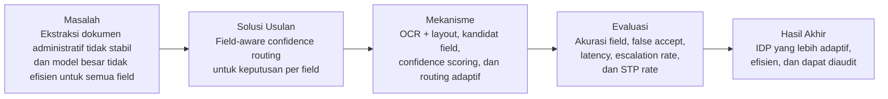
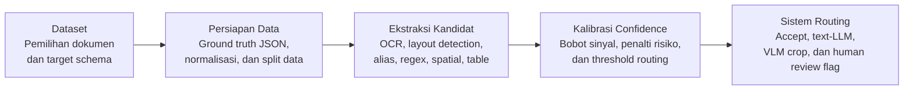

# BAB III
# METODE PENELITIAN

## 3.1 Kerangka Pikir



**Gambar 3.1 Diagram Kerangka Pikir**

Kerangka pikir penelitian ini dimulai dari pengamatan bahwa dokumen administratif berbahasa Indonesia tidak selalu dapat diproses secara stabil menggunakan satu jalur ekstraksi. Dokumen seperti struk, invoice, kuitansi, formulir, dan bukti pembayaran memiliki variasi layout, kualitas scan, format rupiah, singkatan lokal, stempel, tanda tangan, serta kemungkinan teks yang rusak atau tidak terbaca sempurna oleh OCR. Kondisi tersebut membuat OCR dan rule sederhana tetap berguna, tetapi tidak selalu cukup untuk field yang ambigu atau berisiko tinggi. Sebaliknya, penggunaan LLM atau VLM untuk seluruh field juga tidak selalu tepat karena dapat meningkatkan biaya, latency, dan risiko keluaran yang sulit diaudit.

Berdasarkan masalah tersebut, penelitian ini menempatkan field sebagai unit keputusan utama. Field seperti `transaction_date`, `vendor_name`, `subtotal`, `tax`, `total_amount`, dan `line_items` tidak selalu memiliki tingkat kesulitan yang sama dalam satu dokumen. Sebagian field dapat dibaca dengan jelas melalui OCR dan validasi sederhana, sedangkan field lain dapat tertutup stempel, berada pada layout yang tidak umum, memiliki format nominal yang mencurigakan, atau menghasilkan beberapa kandidat nilai. Oleh karena itu, penelitian ini mengusulkan field-aware confidence routing, yaitu mekanisme yang menghitung confidence pada setiap field dan menggunakan confidence tersebut untuk menentukan jalur pemrosesan yang paling sesuai.

Mekanisme utama penelitian ini terdiri dari OCR dan layout detection untuk membaca teks serta posisi, candidate field extraction untuk menghasilkan kandidat nilai, confidence scoring untuk menilai tingkat keyakinan field, dan routing untuk menentukan apakah field diterima otomatis, diproses ulang dengan text-only LLM, diproses ulang dengan VLM berbasis crop, atau ditandai untuk human review. Dengan pendekatan ini, LLM dan VLM tidak diperlakukan sebagai pengganti seluruh pipeline, melainkan sebagai jalur eskalasi untuk field yang memang membutuhkan pemrosesan lebih kuat.

 Sistem yang diusulankan akan dibandingkan dengan baseline seperti OCR-only, OCR+rule, OCR+LLM untuk semua field, direct VLM untuk semua field, dan document-level routing. Keberhasilan penelitian tidak hanya diukur dari akurasi ekstraksi, tetapi juga dari kemampuan sistem menurunkan false accept pada field berisiko tinggi, mengurangi penggunaan model besar, serta menjaga latency.

## 3.2 Langkah Penelitian



**Gambar 3.2 Diagram Langkah Penelitian**

### 3.2.1 Dataset dan Target Schema

Penelitian ini menggunakan dokumen administratif berbahasa Indonesia sebagai objek penelitian. Data berasal dari dataset publik yang relevan seperti CORD atau dari struk, invoice, kuitansi, formulir, dan bukti pembayaran yang telah dianonimkan.

Pada tahap ini ditentukan target schema yang akan digunakan dalam seluruh eksperimen. Target schema berisi daftar field yang ingin diekstraksi, misalnya `merchant_name` atau `vendor_name`, `transaction_date`, `subtotal`, `tax`, `total_amount`, dan `line_items`. Jika menggunakan CORD, label asli dataset dipetakan ke schema penelitian. Sebagai contoh, label total pada dataset dipetakan ke `total_amount`, label pajak dipetakan ke `tax`, dan label item dipetakan ke struktur `line_items`. Tidak semua dokumen harus memiliki semua field. Jika suatu field tidak muncul pada dokumen, nilai ground truth untuk field tersebut ditulis sebagai `null`.

Penetapan schema dilakukan sebelum eksperimen dijalankan agar sistem tidak menyesuaikan field secara manual untuk setiap dokumen. Dengan demikian, penelitian tetap bersifat schema-driven, tetapi tidak bergantung pada input label per dokumen. Field configuration hanya berisi tipe data, alias label, aturan validasi, dan tingkat risiko untuk setiap field.

### 3.2.2 Persiapan Data dan Ground Truth

Setelah dataset dan schema ditetapkan, seluruh data disiapkan ke dalam format eksperimen yang seragam. Setiap dokumen diberi `document_id`, file gambar atau PDF, dan ground truth dalam format JSON. Ground truth disusun mengikuti schema penelitian sehingga output dari setiap metode dapat dibandingkan secara langsung. Nilai nominal dinormalisasi menjadi angka, misalnya `Rp. 22.000`, `22,000`, dan `22000` diperlakukan sebagai nilai yang sama jika konteksnya adalah rupiah. Nilai tanggal juga dinormalisasi ke format standar yang ditentukan. Untuk line item, ground truth disimpan sebagai daftar objek yang berisi nama item, kuantitas jika tersedia, dan harga.

Data kemudian dibagi menjadi data pengembangan, validasi, dan pengujian. Data pengembangan digunakan untuk menyusun alias field, aturan kandidat, dan prototipe awal. Data validasi digunakan untuk menentukan bobot confidence, penalti risiko, threshold routing, dan prompt final untuk LLM/VLM. Data pengujian hanya digunakan untuk evaluasi akhir. Pemisahan ini penting agar rule, threshold, dan prompt tidak disesuaikan berdasarkan data yang sama dengan data evaluasi.

Pada tahap ini juga dilakukan verifikasi dasar terhadap data. Verifikasi mencakup kesesuaian `document_id`, kelengkapan ground truth, konsistensi format JSON, serta keberhasilan normalisasi nilai tanggal dan nominal. Langkah ini diperlukan agar evaluasi akhir benar-benar mengukur metode ekstraksi dan routing, bukan kesalahan format data.

### 3.2.3 Ekstraksi Kandidat Field

Tahap ekstraksi kandidat dimulai dengan menjalankan OCR pada setiap dokumen untuk menghasilkan teks, bounding box, dan confidence OCR. Hasil OCR kemudian diproses melalui layout detection sederhana. Token OCR dikelompokkan menjadi baris berdasarkan koordinat vertikal, kemudian baris yang berdekatan dikelompokkan menjadi region. Jika ditemukan pola alignment kolom yang berulang, region tersebut ditandai sebagai kandidat tabel.

Setelah struktur awal diperoleh, sistem menghasilkan kandidat field menggunakan beberapa sinyal. Label alias digunakan untuk mengenali anchor seperti `Total`, `PPN`, `Tanggal`, atau `No Invoice`. Spatial proximity digunakan untuk mencari nilai yang berada di kanan, bawah, atau dekat dengan anchor tersebut. Regex dan aturan tipe data digunakan untuk memeriksa apakah kandidat sesuai dengan bentuk tanggal, nominal, nomor dokumen, atau teks nama. Table position digunakan untuk membedakan line item dari summary field seperti subtotal, pajak, dan total. Semantic similarity dapat digunakan sebagai bantuan ketika label pada dokumen tidak persis sama dengan alias, misalnya `Jumlah Pembayaran` tetap dapat diarahkan ke `total_amount`.

Pada dokumen berbentuk struk atau invoice, line item dan summary field dipisahkan berdasarkan baris. Baris yang mengandung deskripsi teks dan angka nominal, tidak mengandung label summary seperti `subtotal`, `ppn`, atau `total`, serta berada di atas area summary, diklasifikasikan sebagai line item. Sebaliknya, baris yang mengandung label summary diklasifikasikan sebagai field seperti `subtotal`, `tax`, atau `total_amount`. Hasil dari tahap ini bukan keputusan final, tetapi akan dimasukan kedalam daftar kandidat field.

### 3.2.4 Kalibrasi Confidence dan Threshold Routing

Setelah kandidat field terbentuk, akan dilanjutkan dengan menghitung confidence score pada tiap fieldnya. Komponen scoring meliputi kualitas OCR, kecocokan label, kedekatan spasial, validasi schema, konsistensi konteks, dan kesepakatan kandidat.

Bobot confidence, penalti risiko, dan threshold routing dikalibrasi menggunakan data validasi. Beberapa kombinasi bobot dan threshold diuji, kemudian hasilnya dibandingkan berdasarkan field-level exact match, false accept rate, escalation rate, latency, dan cost proxy. Pemilihan kombinasi akhir tidak hanya berdasarkan akurasi tertinggi. Untuk field berisiko tinggi seperti `total_amount`, kombinasi dengan false accept rate lebih rendah lebih diutamakan, meskipun jumlah field yang dieskalasi sedikit lebih besar. Jika dua kombinasi memiliki akurasi dan false accept yang mirip, kombinasi dengan escalation rate dan latency lebih rendah dipilih.

Tahap ini juga menentukan indikator ketidakpastian tekstual dan visual. Ketidakpastian tekstual muncul ketika OCR cukup terbaca, tetapi label, kandidat, atau normalisasi masih ambigu. Ketidakpastian visual muncul ketika OCR confidence rendah, terdapat karakter ambigu seperti `O/0`, `I/1`, atau `S/5`, format nominal terlihat mencurigakan, atau validasi menunjukkan kemungkinan ada karakter yang hilang. Perbedaan ini penting karena ketidakpastian tekstual diarahkan ke text-only LLM, sedangkan ketidakpastian visual lebih sesuai diarahkan ke VLM crop.

### 3.2.5 Sistem Routing dan Output

Tahap terakhir menyatukan seluruh komponen ke dalam sistem routing. Untuk setiap field, sistem menerima kandidat nilai dan confidence score, kemudian menentukan jalur pemrosesan. Field dengan confidence tinggi dan lolos validasi kritis diterima otomatis melalui jalur OCR/rule. Field dengan confidence rendah karena masalah makna, label, atau normalisasi dikirim ke text-only LLM dengan konteks OCR terbatas. Field dengan indikasi masalah visual atau OCR dikirim ke VLM menggunakan expanded crop yang mencakup nilai, label terdekat, dan margin sekitar. Field yang tetap tidak valid atau berisiko tinggi ditandai sebagai human review.

Output sistem disimpan dalam JSON yang memuat nilai asli, nilai ternormalisasi, route yang digunakan, confidence, status validasi, dan keputusan akhir. Metadata ini penting untuk audit karena peneliti dapat melihat apakah kesalahan berasal dari OCR, kandidat field, confidence scoring, routing, atau model eskalasi. Human review dalam penelitian ini dapat diposisikan sebagai flag atau simulasi pada ablation study. Jika tidak dibangun antarmuka koreksi penuh, field yang ditandai human review tetap dapat dihitung sebagai beban review dan digunakan untuk mengukur pengaruh HITL terhadap false accept dan akurasi akhir.

## 3.3 Rancangan Algoritma Field-Aware Confidence Routing

Algoritma yang diusulkan terdiri dari tiga bagian utama, yaitu ekstraksi kandidat field, perhitungan confidence, dan keputusan routing. Ketiga bagian ini dirancang agar dapat diaudit, sehingga setiap keputusan sistem dapat ditelusuri kembali ke sinyal yang digunakan.

### 3.3.1 Ekstraksi Kandidat Field

Ekstraksi kandidat field dimulai dari hasil OCR berupa teks, bounding box, dan confidence. Sistem kemudian melakukan layout detection sederhana dengan mengelompokkan token OCR menjadi baris berdasarkan koordinat vertikal, mengelompokkan baris menjadi region, dan mengenali area tabel jika terdapat pola kolom yang berulang.

Setelah struktur awal terbentuk, sistem mencari kandidat field menggunakan beberapa sinyal:

| Sinyal | Fungsi | Contoh |
|---|---|---|
| Label alias | Mencari label yang sesuai dengan schema field. | `PPN` dipetakan ke `tax`. |
| Spatial proximity | Mencari nilai yang dekat dengan label. | Nilai di kanan `Tanggal` dipilih sebagai kandidat tanggal. |
| Regex/type pattern | Memeriksa kesesuaian tipe data. | `22,000` valid sebagai nominal. |
| Table position | Membedakan line item dan summary field. | Baris `Total 22,000` di bawah tabel dipetakan ke `total_amount`. |
| Semantic similarity | Membantu mengenali label yang tidak ada di alias. | `Jumlah Pembayaran` dipetakan ke `total_amount`. |

Untuk dokumen berbentuk struk atau invoice, pemisahan line item dan summary field dilakukan dengan logika baris. Baris yang mengandung deskripsi teks dan angka nominal, tidak mengandung label summary seperti `subtotal`, `ppn`, atau `total`, serta berada di atas area summary, diklasifikasikan sebagai line item. Baris yang mengandung alias summary diklasifikasikan sebagai field seperti `subtotal`, `tax`, atau `total_amount`.

Contoh hasil kandidat:

```json
{
  "line_items": [
    {"name": "Nasi Goreng", "price": 15000},
    {"name": "Es Teh", "price": 5000}
  ],
  "subtotal": 20000,
  "tax": 2000,
  "total_amount": 22000
}
```

### 3.3.2 Perhitungan Confidence Score

Confidence score dihitung untuk setiap field. Misalkan dokumen memiliki daftar field target:

$$
F(d) = \{f_1, f_2, ..., f_n\}
$$

Untuk setiap field \(f_i\), sistem menghasilkan kandidat nilai \(\hat{y}_i\). Confidence awal dihitung dari kombinasi sinyal berikut:

| Simbol | Komponen | Penjelasan |
|---|---|---|
| \(C_{ocr,i}\) | OCR quality | Rata-rata confidence OCR pada token kandidat. |
| \(C_{label,i}\) | Label match | Kecocokan label terdekat dengan alias atau semantic field. |
| \(C_{spatial,i}\) | Spatial confidence | Kedekatan dan arah posisi label-value. |
| \(V_{schema,i}\) | Schema validation | Kesesuaian dengan format tanggal, nominal, identifier, atau tipe field lain. |
| \(K_{context,i}\) | Context consistency | Konsistensi dengan field lain, misalnya subtotal + tax = total jika tersedia. |
| \(A_{agree,i}\) | Candidate agreement | Kesepakatan antara kandidat dari rule, tabel, LLM, atau VLM. |

Skor awal dihitung menggunakan weighted heuristic:

$$
S_i = w_1C_{ocr,i} + w_2C_{label,i} + w_3C_{spatial,i} + w_4V_{schema,i} + w_5K_{context,i} + w_6A_{agree,i}
$$

dengan syarat:

$$
\sum_{j=1}^{6} w_j = 1
$$

Jika terdapat sinyal yang tidak tersedia, bobot dihitung ulang hanya pada sinyal yang tersedia. Setelah itu, sistem memberi penalti untuk kondisi yang berisiko, seperti format nominal mencurigakan, karakter ambigu, field wajib kosong, atau konflik validasi. Confidence akhir dihitung sebagai berikut:

$$
C_{final,i} = \max(0, S_i - \lambda P_i)
$$

Nilai \(P_i\) merepresentasikan penalti risiko, sedangkan \(\lambda\) mengatur besarnya pengaruh penalti terhadap confidence akhir. Bobot dan threshold ditentukan menggunakan data validasi.

Kalibrasi dilakukan dengan menguji beberapa kombinasi bobot dan threshold pada data validasi. Setiap kombinasi dijalankan pada pipeline yang sama, kemudian dicatat field-level exact match, false accept rate, escalation rate, latency, dan cost proxy. Kombinasi dipilih bukan hanya berdasarkan akurasi tertinggi, tetapi berdasarkan keseimbangan antara akurasi dan risiko. Jika dua kombinasi menghasilkan akurasi yang mirip, kombinasi dengan false accept rate lebih rendah pada field berisiko tinggi dipilih. Jika false accept rate juga sama, kombinasi dengan escalation rate dan latency lebih rendah dipilih.

### 3.3.3 Keputusan Routing

Keputusan routing dibuat berdasarkan confidence akhir dan jenis ketidakpastian. Sistem membedakan ketidakpastian tekstual dan ketidakpastian visual. Ketidakpastian tekstual terjadi ketika OCR cukup terbaca, tetapi makna label, pemilihan kandidat, atau normalisasi nilai masih ambigu. Ketidakpastian visual terjadi ketika OCR confidence rendah, format terlihat rusak, terdapat karakter mencurigakan, atau validasi menunjukkan kemungkinan ada karakter yang hilang.

Indikator ketidakpastian tekstual meliputi label match rendah, lebih dari satu kandidat memiliki skor yang berdekatan, OCR confidence masih cukup baik, atau nilai kandidat lolos format dasar tetapi belum jelas merupakan field yang benar. Indikator ketidakpastian visual meliputi OCR confidence rendah, karakter ambigu seperti `O/0`, `I/1`, atau `S/5`, format nominal atau tanggal yang mencurigakan, dan konflik validasi yang mengindikasikan kemungkinan karakter hilang. Contohnya, `Rp. 15,00` pada konteks rupiah dapat dianggap mencurigakan jika pola dokumen menunjukkan nilai ribuan atau jika subtotal, pajak, dan total tidak konsisten.

Aturan routing awal adalah sebagai berikut:

$$
R(f_i)=
\begin{cases}
accept, & C_{final,i} \geq \tau_{accept} \text{ dan validasi kritis lolos} \\
text\text{-}LLM, & C_{final,i} < \tau_{accept} \text{ dan ketidakpastian tekstual dominan} \\
VLM\text{-}crop, & C_{final,i} < \tau_{accept} \text{ dan ketidakpastian visual dominan} \\
human\text{-}review, & C_{final,i} < \tau_{review} \text{ atau validasi kritis tetap gagal}
\end{cases}
$$

Nilai awal yang digunakan adalah \(\tau_{accept}=0.85\) dan \(\tau_{review}=0.60\), namun nilai akhir ditentukan melalui data validasi. Text-only LLM menerima konteks OCR terbatas, seperti label terdekat, baris yang sama, beberapa baris sekitar, dan field lain yang sudah diterima. VLM menerima expanded crop yang berisi bounding box nilai, label terdekat, dan margin sekitar agar informasi penting tidak terpotong.

Human review digunakan sebagai flag untuk field yang masih tidak valid atau berisiko tinggi. Dalam evaluasi utama, field yang berstatus human review dapat dihitung sebagai belum selesai otomatis. Dalam ablation atau simulasi HITL, field tersebut dapat diganti dengan ground truth untuk mengukur akurasi setelah review dan beban kerja manusia melalui human review rate. Dengan cara ini, penelitian tidak harus membangun antarmuka koreksi penuh, tetapi tetap dapat mengevaluasi dampak HITL terhadap risiko dan beban koreksi.

## 3.4 Rancangan Evaluasi Eksperimental

Evaluasi dilakukan untuk mengetahui apakah metode field-aware confidence routing memberikan keseimbangan yang lebih baik antara akurasi, efisiensi, dan pengendalian risiko dibandingkan baseline. Evaluasi dilakukan pada data pengujian yang tidak digunakan untuk membuat rule, mengatur bobot confidence, atau menentukan threshold.

Rancangan evaluasi disusun agar menjawab pertanyaan penelitian secara langsung. Evaluasi candidate field extraction digunakan untuk menilai apakah sistem mampu menghasilkan kandidat field yang benar dari OCR dan layout. Evaluasi confidence dan routing digunakan untuk menilai apakah sistem mampu membedakan field yang aman diterima dari field yang perlu dieskalasi. Evaluasi baseline digunakan untuk menilai apakah field-level routing lebih baik dibanding pendekatan OCR-only, OCR+rule, OCR+LLM semua field, direct VLM semua field, dan document-level routing. Evaluasi HITL digunakan sebagai ablation untuk menilai pengaruh review manusia terhadap false accept dan beban kerja.

Metode usulan dibandingkan dengan beberapa baseline berikut:

| Kode | Metode | Definisi |
|---|---|---|
| B1 | OCR-only | Mengambil teks OCR dan normalisasi sederhana tanpa rule field-level yang kompleks. |
| B2 | OCR + rule | Menggunakan alias, regex, spatial proximity, dan table position tanpa LLM/VLM. |
| B3 | OCR + LLM semua field | Semua target field diekstraksi dari konteks OCR menggunakan LLM tanpa routing confidence. |
| B4 | Direct VLM semua field | Semua target field diekstraksi dari gambar dokumen menggunakan VLM tanpa routing confidence. |
| B5 | Document-level routing | Satu keputusan routing digunakan untuk seluruh dokumen, bukan per field. |
| Proposed | Field-aware confidence routing | Keputusan accept, text-LLM, VLM-crop, atau human review dibuat pada level field. |

Jika model LLM atau VLM tertentu tidak dapat direplikasi persis karena keterbatasan sumber daya, penelitian menggunakan model yang tersedia secara fungsional setara dan mencatat konfigurasi tersebut secara eksplisit. Seluruh baseline dijalankan pada split data yang sama, dengan aturan normalisasi dan ground truth yang sama.

Selain baseline, dilakukan ablation study untuk melihat pengaruh masing-masing komponen:

| Kode | Ablation | Tujuan |
|---|---|---|
| A1 | Tanpa schema validation | Mengukur dampak aturan format dan tipe data. |
| A2 | Tanpa context consistency | Mengukur dampak pengecekan seperti subtotal + tax = total. |
| A3 | Tanpa VLM crop | Menguji apakah text-only LLM cukup untuk kasus visual/OCR. |
| A4 | Tanpa field-level routing | Mengukur dampak jika routing hanya dilakukan pada level dokumen. |
| A5 | Dengan/tanpa HITL simulation | Mengukur trade-off antara akurasi akhir dan beban review manusia. |

Metrik evaluasi yang digunakan adalah sebagai berikut:

| Metrik | Fungsi |
|---|---|
| Field-level Exact Match | Mengukur apakah nilai field sama dengan ground truth setelah normalisasi. |
| Precision, Recall, F1-score | Mengukur performa ekstraksi field yang tersedia dan tidak tersedia. |
| CER/WER | Mengukur kesalahan karakter atau kata pada field teks. |
| Numeric Error | Mengukur selisih nilai untuk field nominal. |
| False Accept Rate | Mengukur field salah yang tetap diterima otomatis. |
| Escalation Rate | Mengukur persentase field yang dikirim ke LLM atau VLM. |
| Human Review Rate | Mengukur persentase field yang perlu review manusia. |
| Straight-Through Processing Rate | Mengukur dokumen atau field yang selesai tanpa review manusia. |
| Latency | Mengukur waktu pemrosesan setiap dokumen dan field. |
| Cost Proxy | Mengestimasi penggunaan model besar berdasarkan jumlah field yang dieskalasi. |
| Calibration Error | Mengukur kesesuaian confidence dengan peluang prediksi benar. |

Sebelum dibandingkan dengan ground truth, seluruh output dinormalisasi terlebih dahulu. Contohnya, `Rp. 22.000`, `22,000`, dan `22000` dinormalisasi menjadi nilai numerik yang sama jika konteksnya adalah rupiah. Untuk tanggal, format seperti `04/05/2026` dinormalisasi menjadi format standar sesuai aturan yang ditetapkan. Evaluasi dilakukan pada level field agar kesalahan pada field penting seperti total, pajak, tanggal, dan nomor dokumen dapat dianalisis secara spesifik.

Analisis hasil dilakukan dengan membandingkan akurasi, false accept rate, jumlah eskalasi, latency, cost proxy, dan STP rate dari setiap metode. Untuk memperkuat validitas perbandingan, hasil per-field atau per-dokumen dapat diuji menggunakan uji statistik berpasangan. Jika metrik berbentuk benar/salah, McNemar test dapat digunakan untuk membandingkan dua metode pada pasangan data yang sama. Jika metrik berupa skor atau latency yang tidak berdistribusi normal, Wilcoxon signed-rank test dapat digunakan. Uji statistik ini bersifat pendukung dan digunakan untuk memastikan bahwa perbedaan performa tidak hanya terjadi karena variasi sampel.

Keberhasilan metode usulan dinilai dari tiga aspek. Pertama, metode usulan harus menghasilkan field-level exact match yang kompetitif atau lebih baik dibanding baseline. Kedua, metode usulan harus menurunkan false accept rate, terutama pada field berisiko tinggi seperti `total_amount`. Ketiga, metode usulan harus mengurangi penggunaan LLM/VLM dibanding baseline yang menggunakan model besar untuk semua field, sehingga latency dan cost proxy tetap terkendali. Jika ketiga aspek tersebut terpenuhi, maka field-aware confidence routing dapat dianggap memberikan kontribusi terhadap akurasi, efisiensi, dan auditabilitas sistem IDP.
