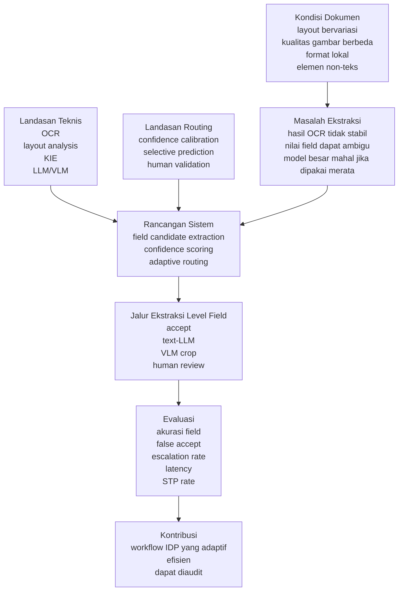
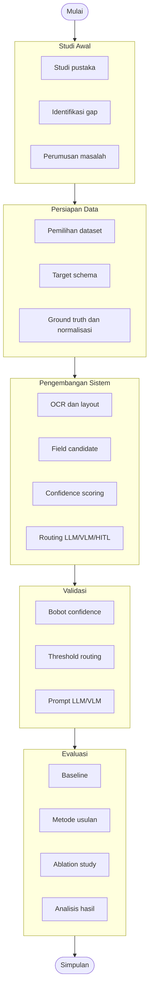

# BAB III
# METODE PENELITIAN

## 3.1 Kerangka Pikir



**Gambar 3.1 Diagram Kerangka Pikir**

Kerangka pikir penelitian ini disusun sebagai hubungan antara kondisi dokumen, landasan teknis, landasan penentuan rute ekstraksi, rancangan sistem, dan evaluasi. Kondisi awal yang menjadi perhatian adalah dokumen transaksi, invoice, receipt, dan laporan keuangan berbahasa Indonesia yang memiliki variasi layout, kualitas gambar, format penulisan lokal, serta elemen visual non-teks. Variasi tersebut dapat menyebabkan hasil OCR dan ekstraksi informasi tidak selalu stabil.

Penelitian ini memanfaatkan kajian pada OCR, layout analysis, Key Information Extraction, serta model berbasis LLM dan VLM. OCR dan layout analysis menyediakan teks, posisi, dan struktur awal dokumen. KIE digunakan untuk memetakan informasi dokumen ke field yang dievaluasi. LLM dan VLM diposisikan sebagai jalur pemrosesan yang lebih kuat ketika hasil dari jalur ringan belum cukup meyakinkan.

Untuk penentuan rute ekstraksi, penelitian ini menggunakan gagasan confidence calibration, selective prediction, dan human validation. Confidence tidak dipahami sebagai skor tunggal untuk seluruh dokumen, melainkan sebagai ukuran keyakinan pada unit field. Selective prediction memberi dasar bahwa sistem dapat menerima hasil yang cukup yakin dan menunda atau mengalihkan hasil yang berisiko. Human validation diposisikan sebagai mekanisme pengendalian risiko untuk kasus yang tidak memenuhi ambang kepercayaan.

Berdasarkan hubungan tersebut, rancangan sistem diarahkan pada field-aware confidence routing. Sistem menghasilkan field candidate, menghitung confidence, lalu menentukan rute ekstraksi pada level field. Jalur yang mungkin dipilih adalah menerima hasil OCR/rule, mengirim konteks OCR ke text-only LLM, mengirim crop gambar ke VLM, atau menandai field untuk human review. Dengan kerangka ini, model besar tidak digunakan secara merata pada seluruh dokumen, tetapi hanya pada bagian yang membutuhkan pemrosesan lebih kuat.

Evaluasi dilakukan untuk menilai apakah kerangka tersebut mampu menghasilkan workflow IDP yang lebih adaptif, efisien, dan dapat diaudit. Ukuran keberhasilan tidak hanya mencakup akurasi field, tetapi juga false accept rate, escalation rate, latency, dan Straight-Through Processing rate. Dengan demikian, kerangka pikir penelitian tidak hanya menempatkan ekstraksi sebagai masalah akurasi, tetapi juga sebagai masalah penentuan rute ekstraksi dan pengendalian risiko.

## 3.2 Langkah Penelitian



**Gambar 3.2 Diagram Langkah Penelitian**

### 3.2.1 Studi Awal

Tahap awal dilakukan untuk membangun dasar teoretis dan posisi penelitian. Kajian dilakukan terhadap IDP, OCR, document understanding, table understanding, OCR-free model, VLM, OCR+LLM, confidence calibration, selective prediction, dan human-in-the-loop. Hasil kajian digunakan untuk merumuskan masalah penelitian, menentukan gap, serta menyusun baseline pembanding.

Pada tahap ini juga ditentukan batas penelitian. Fokus penelitian diarahkan pada workflow ekstraksi yang melakukan routing ekstraksi pada level field, bukan pada pengembangan OCR baru atau pelatihan VLM baru. Dengan batas tersebut, komponen OCR, LLM, dan VLM diperlakukan sebagai bagian dari sistem yang akan dibandingkan dan diorkestrasikan.

### 3.2.2 Data Penelitian

Data penelitian berasal dari dataset publik yang relevan atau dari dokumen yang telah dianonimkan. Jenis dokumen yang dipilih mencakup receipt, invoice, kuitansi, atau laporan keuangan sederhana karena jenis dokumen tersebut memiliki struktur informasi yang dapat dievaluasi. Jika menggunakan dataset publik seperti CORD, label asli dataset dipetakan ke target schema penelitian.

Pada tahap ini ditentukan target schema, format ground truth, dan pembagian data. Target schema berisi daftar field yang dievaluasi secara konsisten pada seluruh metode. Ground truth disimpan dalam format JSON agar output setiap metode dapat dibandingkan secara langsung. Nilai nominal, tanggal, dan format teks tertentu dinormalisasi sebelum evaluasi. Data kemudian dibagi menjadi data pengembangan, validasi, dan pengujian. Data pengembangan digunakan untuk menyusun aturan awal dan konfigurasi field. Data validasi digunakan untuk memilih parameter. Data pengujian hanya digunakan untuk evaluasi akhir.

### 3.2.3 Pengembangan Sistem

Tahap pengembangan sistem bertujuan membangun pipeline eksperimen yang sama untuk metode usulan dan baseline. Pipeline dimulai dari preprocessing dokumen, OCR, pembacaan layout, pembentukan field candidate, perhitungan confidence, routing, dan pembuatan output JSON. Penjelasan teknis mengenai field candidate extraction, confidence scoring, dan routing diberikan secara khusus pada Bagian 3.3 agar pembahasan algoritma tidak tercampur dengan tahapan penelitian.

Pada tahap ini juga disiapkan jalur eskalasi berbasis text-only LLM dan VLM. Text-only LLM digunakan untuk kasus yang memerlukan pemahaman konteks dari hasil OCR, sedangkan VLM digunakan ketika ketidakpastian lebih banyak berasal dari kualitas visual atau hasil OCR yang mencurigakan. Human review ditempatkan sebagai flag atau simulasi pada tahap evaluasi, bukan sebagai syarat pembangunan antarmuka penuh.

### 3.2.4 Validasi Parameter

Parameter sistem ditentukan menggunakan data validasi. Parameter yang divalidasi meliputi bobot confidence, penalti risiko, threshold accept, threshold review, indikator ketidakpastian visual, dan prompt LLM/VLM. Validasi dilakukan sebelum evaluasi akhir agar tidak terjadi penyesuaian berdasarkan data pengujian.

Pemilihan parameter tidak hanya didasarkan pada akurasi tertinggi. Kombinasi parameter dipilih dengan mempertimbangkan field-level exact match, false accept rate, escalation rate, latency, dan cost proxy. Untuk field berisiko tinggi, false accept rate diberi perhatian lebih besar karena kesalahan yang diterima otomatis lebih berbahaya daripada field yang dieskalasi.

### 3.2.5 Evaluasi Akhir

Tahap akhir dilakukan dengan menjalankan metode usulan dan seluruh baseline pada data pengujian yang sama. Baseline yang digunakan meliputi OCR-only, OCR+rule, OCR+LLM untuk semua field, direct VLM untuk semua field, dan document-level routing. Selain itu, ablation study dilakukan untuk melihat pengaruh schema validation, context consistency, VLM crop, field-level routing, dan human review simulation.

Hasil evaluasi dianalisis menggunakan metrik field-level exact match, precision, recall, F1-score, CER/WER, numeric error, false accept rate, escalation rate, human review rate, latency, cost proxy, dan Straight-Through Processing rate. Hasil akhir digunakan untuk menilai apakah metode usulan mampu menjaga akurasi, menurunkan risiko salah terima, dan mengurangi penggunaan model besar dibanding baseline.

## 3.3 Algoritma Routing

Algoritma yang diusulkan menjelaskan bagaimana sistem mengubah hasil OCR dan layout menjadi penentuan rute pemrosesan pada level field. Algoritma ini terdiri dari tiga bagian: field candidate extraction, confidence score, dan routing. Ketiga bagian tersebut saling bergantung. Field candidate extraction menyediakan kemungkinan nilai yang akan diuji, confidence score menilai kualitas dan risiko dari kandidat tersebut, sedangkan routing menentukan rute pemrosesan berdasarkan hasil penilaian.

### 3.3.1 Field Candidate Extraction

Field candidate extraction bertujuan menghasilkan daftar kemungkinan nilai untuk setiap field target. Tahap ini tidak langsung menentukan hasil akhir, tetapi menyediakan alternatif nilai beserta bukti pendukungnya. Input dari tahap ini adalah hasil OCR, yaitu teks, bounding box, dan confidence OCR. Jika dokumen berupa PDF atau gambar, preprocessing dilakukan terlebih dahulu agar orientasi, ukuran, dan kualitas gambar cukup layak untuk OCR.

Tahap awal dilakukan dengan membentuk struktur layout sederhana. Token OCR dikelompokkan menjadi baris berdasarkan koordinat vertikal. Baris yang berdekatan kemudian dikelompokkan menjadi region. Jika beberapa baris memiliki pola posisi horizontal yang konsisten, region tersebut ditandai sebagai kandidat tabel. Proses ini diperlukan karena informasi pada dokumen transaksi sering muncul dalam bentuk label-value, blok ringkasan, atau tabel item.

Setelah struktur awal terbentuk, sistem mencari field candidate menggunakan beberapa petunjuk berikut.

| Petunjuk | Fungsi | Contoh |
|---|---|---|
| Label alias | Mengenali anchor yang berhubungan dengan target field. | Label `PPN` dapat menjadi anchor untuk field pajak. |
| Spatial proximity | Menghubungkan label dengan nilai berdasarkan jarak dan arah posisi. | Nilai yang berada di kanan atau bawah label dipilih sebagai kandidat. |
| Regex/type pattern | Memeriksa apakah bentuk kandidat sesuai dengan tipe data field. | Pola nominal, tanggal, atau nomor dokumen. |
| Table position | Membaca hubungan baris dan kolom pada area tabel. | Baris detail dibedakan dari baris ringkasan. |
| Semantic similarity | Membantu menemukan label yang maknanya mirip walaupun tidak sama secara literal. | Variasi label pembayaran dapat diarahkan ke field total. |

Setiap field candidate disimpan bersama metadata agar dapat diaudit. Metadata tersebut mencakup raw text, normalized value jika tersedia, bounding box, label terdekat, region asal, OCR confidence, serta petunjuk yang mendukung kandidat tersebut. Format konseptual field candidate adalah sebagai berikut.

```json
{
  "field": "total_amount",
  "raw_value": "22,000",
  "normalized_value": 22000,
  "value_bbox": [250, 300, 330, 320],
  "label_text": "Total",
  "label_bbox": [50, 300, 110, 320],
  "source": "ocr_rule",
  "evidence": ["label_alias", "spatial_proximity", "currency_pattern"]
}
```

Jika terdapat lebih dari satu kandidat untuk field yang sama, semua kandidat tetap disimpan hingga tahap confidence scoring. Kandidat dengan skor tertinggi dapat dipilih sebagai kandidat utama, sedangkan kandidat lain digunakan untuk menghitung candidate agreement atau mendeteksi ambiguitas. Dengan cara ini, sistem tidak langsung membuang informasi yang mungkin berguna pada tahap routing.

### 3.3.2 Confidence Score

Confidence score dihitung untuk menilai apakah field candidate cukup aman diterima otomatis. Perhitungan dilakukan pada level field, bukan level dokumen. Misalkan dokumen memiliki daftar field target:

$$
F(d) = \{f_1, f_2, ..., f_n\}
$$

Untuk setiap field \(f_i\), sistem menghasilkan kandidat nilai \(\hat{y}_i\). Confidence awal dihitung dari beberapa komponen:

| Simbol | Komponen | Penjelasan |
|---|---|---|
| \(C_{ocr,i}\) | OCR quality | Rata-rata confidence OCR pada token yang membentuk kandidat. |
| \(C_{label,i}\) | Label match | Kecocokan label terdekat dengan alias atau makna field. |
| \(C_{spatial,i}\) | Spatial confidence | Kedekatan posisi antara label dan nilai, termasuk arah kanan, bawah, atau pola tabel. |
| \(V_{schema,i}\) | Schema validation | Kesesuaian kandidat dengan tipe data, format, dan aturan normalisasi. |
| \(K_{context,i}\) | Context consistency | Konsistensi kandidat dengan field lain jika tersedia. |
| \(A_{agree,i}\) | Candidate agreement | Kesepakatan antara beberapa kandidat atau beberapa jalur ekstraksi. |

Skor awal dihitung menggunakan weighted heuristic:

$$
S_i = w_1C_{ocr,i} + w_2C_{label,i} + w_3C_{spatial,i} + w_4V_{schema,i} + w_5K_{context,i} + w_6A_{agree,i}
$$

dengan syarat:

$$
\sum_{j=1}^{6} w_j = 1
$$

Jika suatu komponen tidak tersedia, bobot dihitung ulang hanya pada komponen yang tersedia. Sebagai contoh, context consistency tidak dapat dihitung jika field pendukung tidak ditemukan. Dalam kondisi tersebut, field tidak langsung diberi nilai rendah, tetapi confidence dihitung dari komponen lain yang tersedia.

Setelah skor awal diperoleh, sistem memberikan penalti pada kondisi yang meningkatkan risiko kesalahan. Penalti dapat diberikan ketika kandidat gagal validasi kritis, memiliki format mencurigakan, mengandung karakter ambigu, atau memiliki konflik dengan field lain. Confidence akhir dihitung sebagai berikut:

$$
C_{final,i} = \max(0, S_i - \lambda P_i)
$$

Nilai \(P_i\) merepresentasikan total penalti risiko, sedangkan \(\lambda\) mengatur besarnya pengaruh penalti. Bobot, penalti, dan threshold ditentukan menggunakan data validasi. Pemilihan parameter tidak hanya berdasarkan akurasi tertinggi, tetapi juga mempertimbangkan false accept rate, escalation rate, latency, dan cost proxy.

### 3.3.3 Routing

Routing menentukan jalur pemrosesan untuk setiap field berdasarkan confidence akhir dan jenis ketidakpastian. Sistem membedakan dua jenis ketidakpastian, yaitu ketidakpastian tekstual dan ketidakpastian visual. Ketidakpastian tekstual terjadi ketika OCR cukup terbaca, tetapi pemilihan kandidat, pemahaman label, atau normalisasi masih ambigu. Ketidakpastian visual terjadi ketika hasil OCR mencurigakan karena kualitas gambar, karakter ambigu, atau kemungkinan karakter hilang.

Indikator ketidakpastian tekstual meliputi label match rendah, lebih dari satu kandidat memiliki skor berdekatan, atau kandidat lolos format dasar tetapi belum jelas sebagai field yang benar. Indikator ketidakpastian visual meliputi OCR confidence rendah, karakter ambigu seperti `O/0`, `I/1`, atau `S/5`, format nominal atau tanggal yang mencurigakan, serta konflik validasi yang mengindikasikan kemungkinan kesalahan OCR.

Aturan routing awal adalah sebagai berikut:

$$
R(f_i)=
\begin{cases}
accept, & C_{final,i} \geq \tau_{accept} \text{ dan validasi kritis lolos} \\
text\text{-}LLM, & C_{final,i} < \tau_{accept} \text{ dan ketidakpastian tekstual dominan} \\
VLM\text{-}crop, & C_{final,i} < \tau_{accept} \text{ dan ketidakpastian visual dominan} \\
human\text{-}review, & C_{final,i} < \tau_{review} \text{ atau validasi kritis tetap gagal}
\end{cases}
$$

Nilai awal yang digunakan adalah \(\tau_{accept}=0.85\) dan \(\tau_{review}=0.60\), namun nilai akhir ditentukan melalui data validasi. Pada jalur text-LLM, model hanya menerima konteks OCR yang relevan, seperti label terdekat, baris yang sama, beberapa baris sekitar, dan field lain yang sudah diterima. Pada jalur VLM-crop, sistem mengirim expanded crop yang mencakup nilai, label terdekat, dan margin sekitar agar informasi penting tidak terpotong.

Setelah jalur eskalasi dijalankan, hasilnya divalidasi ulang. Jika hasil LLM atau VLM memenuhi schema dan meningkatkan confidence, field diperbarui dengan route baru. Jika hasil tetap tidak valid, tidak konsisten, atau memiliki risiko tinggi, field diberi status human review. Dalam ruang lingkup penelitian ini, human review dapat berupa flag atau simulasi, sehingga sistem tetap dapat dievaluasi tanpa harus membangun antarmuka koreksi penuh.

Output akhir setiap field memuat nilai, nilai ternormalisasi, route yang digunakan, confidence akhir, status validasi, dan hasil routing. Metadata ini penting karena penelitian tidak hanya mengukur apakah nilai benar, tetapi juga mengamati jalur apa yang digunakan untuk menghasilkan nilai tersebut.

```json
{
  "field": "total_amount",
  "value": "22,000",
  "normalized_value": 22000,
  "route": "vlm_crop",
  "confidence": 0.88,
  "validation_status": "valid",
  "decision": "accept"
}
```
## 3.4 Evaluasi Eksperimental

Evaluasi dilakukan untuk mengetahui apakah metode field-aware confidence routing memberikan keseimbangan yang lebih baik antara akurasi, efisiensi, dan pengendalian risiko dibandingkan baseline. Evaluasi dilakukan pada data pengujian yang tidak digunakan untuk membuat rule, mengatur bobot confidence, atau menentukan threshold.

Rancangan evaluasi disusun agar menjawab pertanyaan penelitian secara langsung. Evaluasi ekstraksi field candidate digunakan untuk menilai apakah sistem mampu menghasilkan field candidate yang benar dari OCR dan layout. Evaluasi confidence dan routing digunakan untuk menilai apakah sistem mampu membedakan field yang aman diterima dari field yang perlu dieskalasi. Evaluasi baseline digunakan untuk menilai apakah field-level routing lebih baik dibanding pendekatan OCR-only, OCR+rule, OCR+LLM semua field, direct VLM semua field, dan document-level routing. Evaluasi HITL digunakan sebagai ablation untuk menilai pengaruh review manusia terhadap false accept dan beban kerja.

Metode usulan dibandingkan dengan beberapa baseline berikut:

| Kode | Metode | Definisi |
|---|---|---|
| B1 | OCR-only | Mengambil teks OCR dan normalisasi sederhana tanpa rule field-level yang kompleks. |
| B2 | OCR + rule | Menggunakan alias, regex, spatial proximity, dan table position tanpa LLM/VLM. |
| B3 | OCR + LLM semua field | Semua target field diekstraksi dari konteks OCR menggunakan LLM tanpa routing confidence. |
| B4 | Direct VLM semua field | Semua target field diekstraksi dari gambar dokumen menggunakan VLM tanpa routing confidence. |
| B5 | Document-level routing | Satu hasil routing digunakan untuk seluruh dokumen, bukan per field. |
| Proposed | Field-aware confidence routing | Route accept, text-LLM, VLM-crop, atau human review dipilih pada level field. |

Jika model LLM atau VLM tertentu tidak dapat direplikasi persis karena keterbatasan sumber daya, penelitian menggunakan model yang tersedia secara fungsional setara dan mencatat konfigurasi tersebut secara eksplisit. Seluruh baseline dijalankan pada split data yang sama, dengan aturan normalisasi dan ground truth yang sama.

Selain baseline, dilakukan ablation study untuk melihat pengaruh masing-masing komponen:

| Kode | Ablation | Tujuan |
|---|---|---|
| A1 | Tanpa schema validation | Mengukur dampak aturan format dan tipe data. |
| A2 | Tanpa context consistency | Mengukur dampak pengecekan seperti subtotal + tax = total. |
| A3 | Tanpa VLM crop | Menguji apakah text-only LLM cukup untuk kasus visual/OCR. |
| A4 | Tanpa field-level routing | Mengukur dampak jika routing hanya dilakukan pada level dokumen. |
| A5 | Dengan/tanpa HITL simulation | Mengukur trade-off antara akurasi akhir dan beban review manusia. |

Metrik evaluasi yang digunakan adalah sebagai berikut:

| Metrik | Fungsi |
|---|---|
| Field-level Exact Match | Mengukur apakah nilai field sama dengan ground truth setelah normalisasi. |
| Precision, Recall, F1-score | Mengukur performa ekstraksi field yang tersedia dan tidak tersedia. |
| CER/WER | Mengukur kesalahan karakter atau kata pada field teks. |
| Numeric Error | Mengukur selisih nilai untuk field nominal. |
| False Accept Rate | Mengukur field salah yang tetap diterima otomatis. |
| Escalation Rate | Mengukur persentase field yang dikirim ke LLM atau VLM. |
| Human Review Rate | Mengukur persentase field yang perlu review manusia. |
| Straight-Through Processing Rate | Mengukur dokumen atau field yang selesai tanpa review manusia. |
| Latency | Mengukur waktu pemrosesan setiap dokumen dan field. |
| Cost Proxy | Mengestimasi penggunaan model besar berdasarkan jumlah field yang dieskalasi. |
| Calibration Error | Mengukur kesesuaian confidence dengan peluang prediksi benar. |

Sebelum dibandingkan dengan ground truth, seluruh output dinormalisasi terlebih dahulu. Normalisasi dilakukan untuk menyamakan variasi penulisan nominal, tanggal, dan format field lain yang secara semantik merepresentasikan nilai yang sama. Evaluasi dilakukan pada level field agar kesalahan dapat dianalisis berdasarkan jenis informasi yang diekstraksi.

Analisis hasil dilakukan dengan membandingkan akurasi, false accept rate, jumlah eskalasi, latency, cost proxy, dan STP rate dari setiap metode. Untuk memperkuat validitas perbandingan, hasil per-field atau per-dokumen dapat diuji menggunakan uji statistik berpasangan. Jika metrik berbentuk benar/salah, McNemar test dapat digunakan untuk membandingkan dua metode pada pasangan data yang sama. Jika metrik berupa skor atau latency yang tidak berdistribusi normal, Wilcoxon signed-rank test dapat digunakan. Uji statistik ini bersifat pendukung dan digunakan untuk memastikan bahwa perbedaan performa tidak hanya terjadi karena variasi sampel.

Keberhasilan metode usulan dinilai dari tiga aspek. Pertama, metode usulan menghasilkan field-level exact match yang kompetitif atau lebih baik dibanding baseline. Kedua, metode usulan menurunkan false accept rate pada field berisiko tinggi. Ketiga, metode usulan mengurangi penggunaan LLM/VLM dibanding baseline yang menggunakan model besar untuk semua field, sehingga latency dan cost proxy tetap terkendali.


