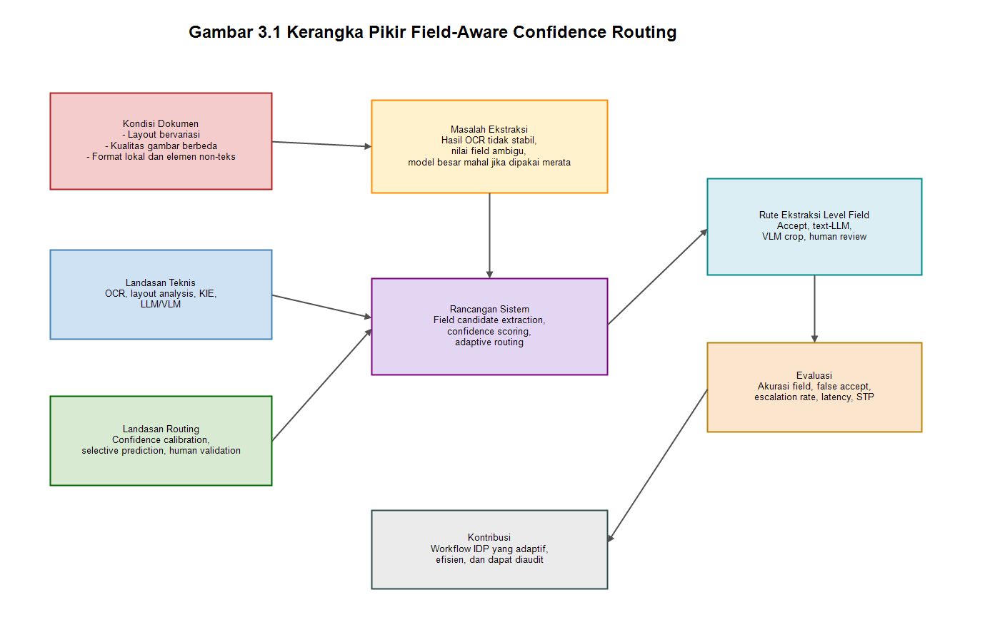
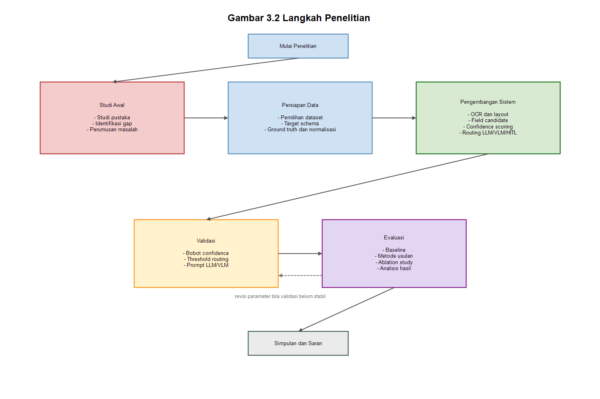

# PROPOSAL TESIS

## Rancang Bangun dan Evaluasi Sistem Intelligent Document Processing Berbasis Field-Aware Confidence Routing untuk Ekstraksi Informasi Terstruktur pada Dokumen Transaksi Berbahasa Indonesia

---

## 1.1 Latar Belakang

[ADD IMAGE HERE: Ilustrasi konteks masalah pada BAB I. Tampilkan beberapa contoh dokumen transaksi seperti invoice, receipt/struk, kuitansi, dan laporan keuangan sederhana dengan variasi layout, stempel, tanda tangan, kualitas scan, dan format nominal. Tujuannya untuk menunjukkan bahwa input dokumen tidak seragam sebelum masuk ke sistem IDP.]

Pemrosesan dokumen transaksi seperti invoice, kuitansi, struk, laporan keuangan sederhana, dan dokumen pendukung operasional masih menjadi tantangan penting dalam proses digitalisasi organisasi. Dokumen-dokumen tersebut sering kali tidak memiliki format yang seragam, memiliki kualitas scan atau foto yang bervariasi, serta mengandung elemen visual seperti stempel, tanda tangan, coretan, singkatan lokal, tabel tidak konsisten, dan catatan tulisan tangan. Kondisi ini membuat proses ekstraksi informasi tidak cukup hanya mengandalkan OCR konvensional atau aturan berbasis template yang statis.

[ADD IMAGE HERE: Diagram evolusi pendekatan IDP. Buat alur ringkas dari OCR konvensional -> OCR + rule/template -> OCR + layout/table parsing -> OCR + LLM -> VLM/OCR-free. Tambahkan catatan bahwa setiap pendekatan memiliki trade-off akurasi, biaya, latency, dan auditability.]

Perkembangan Intelligent Document Processing (IDP) telah memperluas pendekatan ekstraksi informasi dari OCR konvensional menuju kombinasi OCR, analisis layout, rule-based extraction, model deep learning, Large Language Model (LLM), dan Vision-Language Model (VLM). Namun, penggunaan model yang lebih kuat untuk seluruh dokumen tidak selalu efisien karena tingkat kesulitan informasi di dalam dokumen dapat berbeda. Kondisi ini menunjukkan perlunya mekanisme pemrosesan yang lebih adaptif daripada pipeline tunggal pada level dokumen.

[ADD IMAGE HERE: Diagram masalah utama penelitian. Tampilkan satu dokumen yang memiliki beberapa field dengan tingkat kesulitan berbeda: field mudah diterima OCR/rule, field ambigu perlu LLM, field dengan masalah visual perlu VLM crop, dan field berisiko perlu human review. Gambar ini memperjelas alasan routing dilakukan pada level field, bukan seluruh dokumen.]

Masalah utama dalam konteks ini bukan hanya memilih model ekstraksi yang paling akurat, tetapi menentukan **field mana yang cukup aman diterima otomatis dan field mana yang perlu dieskalasi ke proses yang lebih kuat**. Studi terbaru mengenai document information extraction menunjukkan bahwa pipeline berbasis OCR, OCR+MLLM, maupun image-only MLLM memiliki kekuatan dan kelemahan berbeda bergantung pada karakteristik dokumen dan jenis informasi yang diekstraksi (Shen et al., 2026). Penelitian lain juga menunjukkan bahwa kombinasi OCR dan LLM dapat meningkatkan akurasi sekaligus mengelola trade-off antara akurasi dan efisiensi melalui strategi pemrosesan yang berbeda (Wang & Shen, 2025). Hal ini menunjukkan bahwa sistem IDP perlu memiliki mekanisme penentuan rute ekstraksi yang adaptif, terutama ketika kualitas kandidat hasil ekstraksi berbeda antar-field.

Di sisi lain, pemanfaatan LLM dalam document processing juga membawa tantangan baru. LLM dapat membantu memperbaiki hasil OCR, menormalkan format, atau memahami konteks field, tetapi model ini juga berpotensi menghasilkan koreksi yang tidak sepenuhnya sesuai dengan isi dokumen asli. Penelitian mengenai post-OCR correction menekankan bahwa post-OCR correction menggunakan language model perlu dikendalikan (Gupta et al., 2021) karena koreksi teks yang terlalu bebas dapat berisiko pada skenario yang membutuhkan ketelitian tinggi. Dalam dokumen transaksi dan keuangan, kesalahan kecil pada nominal, tanggal, nomor identitas, atau nama pihak dapat menimbulkan konsekuensi operasional dan finansial.

Sistem IDP juga perlu memperhatikan pengendalian risiko, bukan hanya akurasi rata-rata. Pendekatan confidence-aware menjadi penting karena ukuran ketidakpastian dapat digunakan untuk membedakan hasil yang layak diproses otomatis dari hasil yang memerlukan validasi tambahan. Kajian confidence-aware KIE menunjukkan bahwa uncertainty pada Key Information Extraction dapat digunakan (Rombach & Mehdiyev, 2026) untuk memproses prediksi berkepercayaan tinggi secara otomatis dan menandai kasus ambigu untuk validasi manusia.

Karakteristik dokumen lokal juga perlu diperhatikan karena format penulisan, singkatan, stempel, tanda tangan, dan elemen non-teks dapat mempengaruhi kualitas OCR dan ekstraksi. Dataset CORD menunjukkan bahwa struk berbahasa Indonesia memiliki variasi struktur dan anotasi yang relevan untuk studi post-OCR parsing (Park et al., 2019). Hal ini memberi dasar bahwa konteks bahasa dan format lokal dapat menjadi faktor penting dalam perancangan sistem ekstraksi dokumen.

[ADD IMAGE HERE: Diagram konsep solusi penelitian. Tampilkan ringkasan input dokumen -> field candidate -> confidence score -> routing field -> output terstruktur. Beri label route: OCR/rule, text-LLM, VLM crop, human review. Cocok sebagai gambar penutup latar belakang sebelum masuk rumusan masalah.]

Berdasarkan permasalahan tersebut, penelitian ini diarahkan pada perancangan sistem IDP berbasis **field-level confidence-aware adaptive routing**. Fokusnya adalah mekanisme orkestrasi ekstraksi yang menentukan rute ekstraksi berdasarkan kualitas kandidat, risiko, dan confidence pada unit informasi yang diekstraksi. Dengan fokus tersebut, penelitian tidak diarahkan untuk membangun OCR baru, melainkan untuk mengevaluasi workflow ekstraksi yang lebih adaptif dan dapat diaudit.
## 1.2 Perumusan Masalah

Berdasarkan latar belakang tersebut, permasalahan penelitian dirumuskan sebagai berikut:

1. Bagaimana merancang sistem IDP yang dapat melakukan routing ekstraksi pada level field untuk dokumen transaksi berbahasa Indonesia?
2. Bagaimana menghitung confidence score field berdasarkan kualitas OCR, kecocokan label, posisi, validasi schema, dan konsistensi konteks?
3. Bagaimana menentukan route yang sesuai untuk setiap field, seperti OCR/rule, text-LLM, VLM crop, atau human review?
4. Bagaimana performa metode field-level confidence-aware routing dibandingkan dengan baseline OCR-only, OCR+rule, OCR+LLM, direct VLM, dan document-level routing?

## 1.3 Tujuan Penelitian

Tujuan penelitian ini adalah:

1. Merancang workflow IDP untuk ekstraksi informasi pada dokumen transaksi berbahasa Indonesia.
2. Mengembangkan mekanisme confidence scoring pada level field.
3. Mengembangkan routing ekstraksi yang memilih route pemrosesan berdasarkan confidence dan jenis ketidakpastian field.
4. Mengevaluasi metode usulan terhadap beberapa baseline menggunakan metrik akurasi, false accept rate, escalation rate, latency, dan Straight-Through Processing rate.

## 1.4 Manfaat Penelitian

Manfaat penelitian ini adalah:

1. Memberikan rancangan workflow IDP yang lebih adaptif untuk dokumen transaksi dengan format tidak tetap.
2. Membantu mengurangi penggunaan model besar pada field yang dapat diproses dengan metode ringan.
3. Memberikan mekanisme evaluasi yang mempertimbangkan akurasi, risiko salah terima, latency, dan kebutuhan human review.
4. Menjadi referensi bagi pengembangan sistem ekstraksi dokumen yang membutuhkan audit trail pada level field.

## 1.5 Ruang Lingkup Penelitian

Ruang lingkup penelitian ini dibatasi sebagai berikut:

1. Dokumen yang dikaji adalah dokumen transaksi berbahasa Indonesia, seperti receipt, invoice, kuitansi, atau laporan keuangan sederhana.
2. Penelitian berfokus pada routing ekstraksi level field, bukan pada pengembangan OCR, LLM, atau VLM baru.
3. Field yang dievaluasi mengikuti target schema yang ditentukan pada tahap metodologi.
4. Human review diposisikan sebagai flag atau simulasi evaluasi, bukan sebagai antarmuka koreksi penuh.
5. Evaluasi dilakukan menggunakan dataset yang memiliki ground truth terstruktur.

## Referensi

Gupta, H., Del Corro, L., Broscheit, S., Hoffart, J., & Brenner, E. (2021). Unsupervised multi-view post-OCR error correction with language models. *Proceedings of the 2021 Conference on Empirical Methods in Natural Language Processing*, 8647–8657. https://aclanthology.org/2021.emnlp-main.680/

Park, S., Shin, S., Lee, B., Lee, J., Surh, J., Seo, M., & Lee, H. (2019). CORD: A consolidated receipt dataset for post-OCR parsing. *Proceedings of the Workshop on Document Intelligence at NeurIPS 2019*. https://github.com/clovaai/cord

Rombach, A., & Mehdiyev, N. (2026). Beyond accuracy: Understanding model confidence in key information extraction with conformal prediction. *International Journal on Document Analysis and Recognition*. https://doi.org/10.1007/s10032-026-00572-y

Shen, J., Yuan, P., Ghosh, A., Mai, Y., & Dahlmeier, D. (2026). *OCR or not? Rethinking document information extraction in the MLLMs era with real-world large-scale datasets*. arXiv. https://arxiv.org/abs/2603.02789

Wang, Z., & Shen, X. (2025). *Hybrid OCR-LLM framework for enterprise-scale document information extraction under copy-heavy task*. arXiv. https://arxiv.org/abs/2510.10138


---

# BAB II
# TINJAUAN PUSTAKA

## 2.1 Intelligent Document Processing

[ADD IMAGE HERE: Diagram taksonomi IDP untuk BAB II. Tampilkan komponen umum IDP: document input, preprocessing, OCR/document parsing, layout analysis, information extraction, validation, human review, dan structured output. Gambar ini berfungsi sebagai peta teori sebelum membahas KIE dan routing.]

Intelligent Document Processing (IDP) adalah proses mengubah dokumen tidak terstruktur atau dokumen dengan format tidak tetap menjadi data terstruktur yang dapat digunakan oleh sistem. Kajian IDP umumnya menempatkan OCR, analisis layout, ekstraksi informasi, validasi, dan ekspor data sebagai rangkaian proses yang saling bergantung. Perkembangan bidang ini menunjukkan pergeseran dari sekadar pengenalan teks menuju pemahaman struktur dokumen dan ekstraksi informasi yang sesuai dengan kebutuhan downstream system.

Key Information Extraction (KIE) merupakan salah satu task utama dalam IDP karena berfokus pada pengambilan informasi bernilai dari dokumen. Dataset seperti FUNSD, CORD, SROIE, dan Kleister menunjukkan bahwa KIE melibatkan hubungan antara teks, posisi, struktur layout, dan schema anotasi, bukan hanya hasil OCR mentah (Jaume et al., 2019; Park et al., 2019; Huang et al., 2019; Stanisławek et al., 2021). Variasi dataset tersebut juga memperlihatkan bahwa karakteristik dokumen, mulai dari form, receipt, hingga dokumen panjang, mempengaruhi pendekatan ekstraksi yang digunakan.

## 2.2 Ekstraksi Dokumen

[ADD IMAGE HERE: Diagram perbedaan OCR, layout detection, dan field candidate extraction. Tampilkan OCR menghasilkan teks+bbox+confidence, layout detection mengelompokkan baris/region/tabel, lalu field candidate extraction memetakan elemen tersebut ke field target. Gambar ini membantu membedakan tiga istilah yang sering tercampur.]

Optical Character Recognition (OCR) merupakan fondasi awal dalam banyak sistem IDP. Tesseract menjadi salah satu OCR engine klasik yang banyak digunakan dan memberikan dasar penting tentang line finding, klasifikasi karakter, dan adaptive recognition (Smith, 2007). Perkembangan OCR modern kemudian mengarah pada sistem yang lebih ringan dan praktis seperti PP-OCR, serta pendekatan berbasis Transformer seperti TrOCR (Du et al., 2020; Li et al., 2023). PP-OCR relevan karena menunjukkan bahwa OCR praktis perlu mempertimbangkan efisiensi dan ukuran model, sedangkan TrOCR menunjukkan bahwa pre-trained Transformer dapat meningkatkan pengenalan teks cetak maupun tulisan tangan.

Hasil OCR tidak otomatis setara dengan struktur informasi dokumen. OCR umumnya menghasilkan token teks, posisi, dan confidence, sementara pemetaan token ke unit informasi membutuhkan pemrosesan layout dan ekstraksi kandidat. Oleh karena itu, Layout detection dan field candidate extraction dapat dipahami sebagai dua tahap yang berbeda: layout detection mengenali organisasi visual dokumen, sedangkan field candidate extraction menghubungkan elemen visual-teks tersebut dengan struktur informasi yang dievaluasi.

Layout analysis telah berkembang melalui toolkit dan dataset seperti LayoutParser, PubLayNet, DocLayNet, dan DocLayout-YOLO (Shen et al., 2021; Zhong et al., 2019; Pfitzmann et al., 2022; Zhao et al., 2024). LayoutParser menyediakan toolkit untuk document image analysis berbasis deep learning, PubLayNet menyediakan dataset layout skala besar dari artikel ilmiah, DocLayNet menyediakan anotasi layout manusia untuk ragam dokumen, sedangkan DocLayout-YOLO menekankan trade-off antara kecepatan dan akurasi pada layout analysis. Kajian ini mendukung rancangan penelitian bahwa OCR perlu dilengkapi dengan struktur posisi sebelum sistem dapat melakukan routing pada level field.

## 2.3 Document Understanding

[ADD IMAGE HERE: Timeline atau peta model document understanding. Urutkan LayoutLM, LayoutLMv2, LayoutLMv3, DocFormer, StructuralLM, PICK, FormNet, dan LiLT berdasarkan pendekatan utama: text-layout, multimodal, graph/structure, dan language-independent layout. Gambar ini membantu pembaca melihat perkembangan model.]

Penelitian document understanding modern banyak dipengaruhi oleh model multimodal yang menggabungkan teks, layout, dan visual. LayoutLM memperkenalkan pre-training yang menggabungkan teks dan informasi layout untuk document image understanding (Xu et al., 2020). LayoutLMv2 memperluas pendekatan tersebut dengan integrasi teks, layout, dan image dalam framework multimodal, termasuk spatial-aware self-attention dan pre-training task untuk cross-modality interaction (Xu et al., 2021). LayoutLMv3 kemudian menyederhanakan arsitektur dan tujuan pre-training melalui unified text and image masking serta word-patch alignment (Huang et al., 2022).

Di luar model LayoutLM, beberapa pendekatan lain juga relevan untuk KIE. DocFormer menggunakan multimodal self-attention untuk menggabungkan teks, visual, dan spatial features (Appalaraju et al., 2021). StructuralLM menekankan cell-level layout information untuk form understanding (Li et al., 2021). PICK menggunakan graph learning dan graph convolution untuk memanfaatkan hubungan visual dan tekstual pada dokumen kompleks (Yu et al., 2021). FormNet menunjukkan bahwa serialization token pada form-like document dapat menjadi masalah, sehingga dibutuhkan structural encoding melalui Rich Attention dan Super-Tokens (Lee et al., 2022). LiLT relevan untuk konteks multibahasa karena mencoba memisahkan layout structure dari language-specific text model (Wang et al., 2022).

## 2.4 Table Understanding

[ADD IMAGE HERE: Ilustrasi table understanding pada invoice atau receipt. Tampilkan area tabel dengan baris item dan bagian ringkasan, lalu tunjukkan table detection, row/column structure recognition, dan pemisahan informasi detail vs ringkasan. Gambar ini menjelaskan peran TableBank, PubTables-1M, dan TableFormer.]

Banyak dokumen transaksi, invoice, receipt, dan laporan keuangan menyimpan informasi penting dalam bentuk tabel, misalnya daftar barang pada invoice, item pembelian pada struk, atau rincian pembayaran. Table understanding menjadi penting karena struktur baris dan kolom sering kali tidak eksplisit, terutama pada dokumen scan atau foto. TableBank menyediakan dataset besar untuk table detection dan recognition melalui weak supervision dari dokumen Word dan LaTeX (Li et al., 2020). PubTables-1M menyediakan hampir satu juta tabel dengan ground truth yang lebih lengkap dan mengatasi masalah inconsistency seperti oversegmentation (Smock et al., 2022). TableFormer menggunakan Transformer untuk table structure recognition dan melaporkan peningkatan TEDS pada tabel sederhana dan kompleks (Nassar et al., 2022). Smock et al. (2023) juga menekankan bahwa konsistensi benchmark table structure recognition sangat mempengaruhi performa dan evaluasi model.

## 2.5 Model Generatif Dokumen

[ADD IMAGE HERE: Diagram perbandingan pendekatan OCR-based, OCR+LLM, OCR-free, dan VLM. Tampilkan input dan output masing-masing: OCR-based memakai teks+bbox, OCR+LLM memakai hasil OCR sebagai konteks, OCR-free/VLM memakai gambar langsung. Tambahkan trade-off auditability, biaya, dan kemampuan visual.]

Pendekatan OCR-free mencoba memahami dokumen langsung dari gambar tanpa menjadikan OCR sebagai tahap terpisah. Donut merupakan salah satu model penting karena melakukan document understanding dengan Transformer tanpa OCR engine tradisional dan menunjukkan bahwa OCR dependency dapat menyebabkan biaya komputasi, error propagation, serta keterbatasan bahasa atau domain (Kim et al., 2022). Nougat memperluas gagasan OCR-free untuk dokumen akademik dengan menghasilkan markup dari halaman ilmiah (Blecher et al., 2023).

Perkembangan Vision-Language Model (VLM) dan Multimodal Large Language Model (MLLM) memperkuat arah ini. GOT-OCR 2.0 memperkenalkan gagasan OCR-2.0 melalui model unified end-to-end sekitar 580 juta parameter yang dapat menangani teks, formula, tabel, chart, dan region-level recognition (Wei et al., 2024). Qwen2.5-VL menunjukkan kemampuan visual recognition, object localization, document parsing, dan structured data extraction dari dokumen seperti invoice, form, tabel, dan layout kompleks (Bai et al., 2025). Greif et al. (2025) juga menunjukkan bahwa MLLM dapat digunakan untuk OCR, OCR post-correction, dan NER pada dokumen historis, bahkan memperlihatkan potensi multimodal post-correction ketika OCR konvensional gagal.

Di sisi lain, LLM berbasis teks tetap relevan untuk ekstraksi dari OCR output. LMDX menunjukkan penggunaan language model untuk document information extraction dan localization dengan perhatian pada grounding (Perot et al., 2023). Gupta et al. (2021) menunjukkan bahwa language model dapat membantu post-OCR correction dengan multi-view OCR, tetapi juga menekankan risiko unconstrained generation pada skenario yang membutuhkan ketelitian. Chen et al. (2025) mengevaluasi prompt engineering untuk document information extraction dan menunjukkan bahwa rancangan prompt, schema, dan post-processing berpengaruh terhadap hasil ekstraksi. Hu et al. (2025) menunjukkan pemanfaatan LLM untuk key information extraction pada tabel tidak standar.

Kajian terbaru juga mulai membandingkan kebutuhan OCR dalam era MLLM. Shen et al. (2026) melakukan benchmarking pada business-document information extraction dan menunjukkan bahwa image-only pipeline dapat bersaing dengan pendekatan OCR-enhanced pada model tertentu, terutama ketika schema, exemplar, dan instruksi dirancang dengan baik. Namun, OCR tetap memiliki nilai praktis karena menyediakan teks, posisi, dan confidence yang dapat digunakan untuk audit serta integrasi dengan proses ekstraksi yang lebih ringan.

## 2.6 Confidence-Aware Processing

[ADD IMAGE HERE: Diagram konsep confidence-aware processing. Tampilkan hubungan antara confidence calibration, selective prediction, uncertainty, coverage, dan human validation. Gunakan ilustrasi accept jika confidence tinggi, escalate/review jika confidence rendah.]

Confidence score banyak digunakan untuk menyatakan tingkat keyakinan model, tetapi skor tersebut tidak selalu setara dengan probabilitas kebenaran. Guo et al. (2017) menunjukkan bahwa neural network modern sering kali tidak terkalibrasi dengan baik, sehingga confidence tinggi belum tentu mencerminkan peluang benar yang tinggi. Konsep selective classification dari Geifman dan El-Yaniv (2017) memberikan dasar teoretis bahwa sistem dapat menolak prediksi pada kasus tertentu untuk menukar coverage dengan risiko kesalahan yang lebih rendah.

Dalam konteks KIE, Rombach dan Mehdiyev (2026) membahas penggunaan conformal prediction untuk mengukur uncertainty pada ekstraksi informasi. Studi tersebut menekankan bahwa workflow bisnis membutuhkan ukuran kepercayaan yang dapat diinterpretasikan, terutama ketika kesalahan ekstraksi dapat berdampak pada proses finansial atau administratif. Temuan ini menunjukkan bahwa evaluasi KIE perlu mempertimbangkan reliability, coverage, dan kebutuhan validasi manusia, bukan hanya akurasi rata-rata.

Human-in-the-loop (HITL) sering digunakan sebagai mekanisme pengendalian risiko pada sistem otomatis. Pada workflow ekstraksi dokumen, validasi manusia dapat ditempatkan pada kasus yang tidak memenuhi ambang kepercayaan atau gagal aturan validasi. Jika koreksi manusia disimpan, koreksi tersebut juga dapat menjadi sumber informasi untuk dokumen dengan template serupa. Kerangka ini sejalan dengan prinsip AI risk management yang menekankan pengendalian, transparansi, dan monitoring pada sistem AI yang digunakan dalam proses penting (NIST, 2023).

## 2.7 State of the Art

[ADD IMAGE HERE: Peta SOTA berdasarkan area. Buat matriks atau bubble chart dengan area OCR modern, layout parsing, table understanding, OCR-free/VLM, OCR+LLM hybrid, dan confidence-aware KIE. Letakkan paper utama seperti LayoutLMv3, Donut, Qwen2.5-VL, GOT-OCR 2.0, Docling, OCR or Not, Hybrid OCR-LLM, dan Rombach & Mehdiyev.]

Tabel berikut merangkum pendekatan state of the art (SOTA) pada beberapa area yang berkaitan dengan pemrosesan dokumen, yaitu OCR modern, document layout parsing, OCR-free/VLM, OCR+LLM hybrid, dan confidence-aware KIE.

| Paper | Ringkasan | Hasil | Limitasi |
|---|---|---|---|
| LayoutLMv3 (Huang et al., 2022) | Multimodal document representation untuk form, receipt, layout, dan VQA. | LayoutLMv3-large melaporkan FUNSD F1 = 92,08 dan CORD F1 = 97,46. LayoutLMv3-base melaporkan PubLayNet mAP = 95,1 dan DocVQA ANLS = 78,76. Nilai ini menunjukkan bahwa kombinasi teks, layout, dan visual masih sangat kuat untuk document understanding. | Masih bergantung pada OCR/token dan bounding box pada banyak task. |
| Donut (Kim et al., 2022) | OCR-free document understanding. | Pada RVL-CDIP, Donut melaporkan accuracy = 95,30% dengan waktu 752 ms per gambar pada P40 GPU, sedikit di atas LayoutLMv2 95,25% dengan 1.489 ms. Pada implementasi resmi CORD document parsing, model Donut melaporkan score sekitar 91,3 dengan sekitar 0,7 detik per gambar. | Performa tinggi membutuhkan fine-tuning dan data pretraining/sintetis. Output end-to-end lebih sulit diaudit dibanding pipeline yang menyimpan OCR token, bounding box, dan confidence per field. |
| Qwen2.5-VL (Bai et al., 2025) | General VLM untuk OCR, document parsing, visual localization, dan structured extraction. | Untuk Qwen2.5-VL-72B, laporan benchmark menunjukkan DocVQA = 96,4%, InfoVQA = 87,3%, CC-OCR = 79,8%, dan OCRBenchV2 = 61,5/63,7. Beberapa ringkasan benchmark juga mencatat OCRBench sekitar 885 dan ChartQA sekitar 89,5. | Model besar dapat mahal dan latency tinggi jika digunakan untuk seluruh field. Evaluasi benchmark umum belum otomatis membuktikan efisiensi pada workflow IDP field-level. |
| GOT-OCR 2.0 (Wei et al., 2024) | Unified OCR-2.0 untuk text, formula, tabel, chart, sheet music, geometry, dan region-level recognition. | Model berukuran sekitar 580M parameter dan mendukung whole-page OCR, sliced OCR, multi-page OCR, serta region-level recognition berbasis koordinat atau warna. Paper melaporkan hasil unggul pada beberapa benchmark OCR umum, dokumen, chart, dan formatted OCR dibanding baseline yang diuji. | Banyak hasil dilaporkan sebagai preprint dan benchmark lintas task tidak langsung setara dengan KIE administratif. Untuk tesis ini, GOT-OCR lebih cocok sebagai high-tier OCR/VLM route daripada fondasi utama. |
| Docling + TableFormer (Auer et al., 2024; Nassar et al., 2022) | Pipeline PDF/document conversion dengan layout analysis dan table structure recognition. | Model TableFormer yang digunakan dalam ekosistem Docling melaporkan TEDS 95,4 pada simple table, 90,1 pada complex table, dan 93,6 untuk all tables; lebih tinggi dari Camelot 73,0 dan EDD 88,3 pada all tables. Untuk layout, model Docling melaporkan skor agregat sekitar 72,4 sampai 76,8 pada beberapa konfigurasi DocLayNet/model. | Kuat untuk parsing dokumen dan tabel, tetapi bukan sistem confidence-aware field routing. Hasil parsing tetap perlu dipetakan ke field bisnis dan divalidasi. |
| OmniDocBench (Ouyang et al., 2025) | Benchmark SOTA untuk PDF/document parsing multi-domain. | OmniDocBench mengevaluasi text OCR, table recognition, formula recognition, layout detection, dan reading order. Ringkasan benchmark melaporkan contoh hasil: MinerU text edit distance 0,180 untuk English text, Mathpix 0,384 untuk Chinese text, RapidTable sekitar 82,5 TEDS, general VLM sekitar 71-74 TEDS, dan DocLayout-YOLO mAP sekitar 48,7 pada evaluasi layout. | Fokus pada document parsing umum, bukan field-level key information extraction. Benchmark ini lebih cocok sebagai referensi evaluasi parsing, bukan pembanding langsung untuk routing field administratif. |
| Hybrid OCR-LLM Framework (Wang & Shen, 2025) | Hybrid OCR+LLM dan strategy selection untuk enterprise document information extraction. | Pada copy-heavy identity extraction lintas PNG, DOCX, XLSX, dan PDF, framework ini melaporkan F1 = 1,000 dengan latency 0,97 detik untuk dokumen terstruktur, serta F1 = 0,997 dengan latency 0,6 detik pada input gambar menantang ketika memakai PaddleOCR. Paper juga melaporkan peningkatan performa 54x dibanding pendekatan multimodal/naive tertentu. | Routing masih berbasis karakteristik format/dokumen dan strategi extraction, bukan field-level risk routing. Paper masih preprint, sehingga sebaiknya dipakai sebagai baseline/inspirasi, bukan satu-satunya fondasi teoretis. |
| OCR or Not? (Shen et al., 2026) | Benchmark OCR-only, image-only, dan image+OCR untuk business-document IE dengan MLLM. | Pada dua dataset bisnis C1 dan C2, paper melaporkan F1 mean: Gemini 1.5 Pro image-only = 76,8, OCR-only = 74,1, image+OCR = 75,6; GPT-4o image-only = 70,1, OCR-only = 72,8, image+OCR = 73,0; Nova Pro image-only = 71,5, OCR-only = 66,9, image+OCR = 72,1. Paper juga melaporkan latency/cost per page, misalnya Gemini 2.5 Flash sekitar 1,4 detik dan $0,0025 per page, GPT-4o sekitar 2,2 detik dan $0,006 per page. | Dataset industri tidak sepenuhnya publik. Fokusnya membandingkan input modality pada level dokumen, belum membahas accept/escalate/review pada level field. |
| Rombach & Mehdiyev (2026) | Confidence-aware KIE dengan Split Conformal Prediction. | Pada receipt KIE, conformal prediction mencapai marginal coverage 98,3% untuk α = 0,02. Sekitar 70% prediksi menjadi high-confidence singleton; 94% prediksi memiliki set size maksimal 2; average prediction set width = 1,38. Field terstruktur seperti `Prod_price_v` memiliki average set size 1,13 dan coverage 99,51%, sedangkan field lebih ambigu seperti `Tips_v` memiliki average set size 2,24 dan coverage 93,1%. | Fokus pada uncertainty quantification, bukan orkestrasi OCR/rule/LLM/VLM. Namun, paper ini sangat relevan sebagai dasar bahwa confidence perlu dipakai untuk selective automation dan human review. |

Ringkasan SOTA menunjukkan bahwa perkembangan terbaru bergerak ke arah model yang lebih kuat, benchmark yang lebih luas, dan pipeline multimodal yang semakin fleksibel. Namun, sebagian besar pendekatan masih menilai performa pada level task atau dokumen. Ruang kontribusi yang masih terbuka adalah mekanisme yang mengatur jalur pemrosesan pada unit informasi yang lebih kecil dengan mempertimbangkan confidence, risiko, dan biaya pemrosesan.

## Daftar Pustaka

Appalaraju, S., Jasani, B., Kota, B. U., Xie, Y., & Manmatha, R. (2021). DocFormer: End-to-end transformer for document understanding. *ICCV 2021*. https://www.amazon.science/publications/docformer-end-to-end-transformer-for-document-understanding

Auer, C., Lysak, M., Nassar, A., Dolfi, M., Livathinos, N., Vagenas, P., Ramis, C. B., Omenetti, M., Lindlbauer, F., Dinkla, K., Mishra, L., Kim, Y., Gupta, S., de Lima, R. T., Weber, V., Morin, L., Meijer, I., Kuropiatnyk, V., & Staar, P. W. J. (2024). *Docling technical report*. arXiv. https://arxiv.org/abs/2408.09869

Bai, S., Chen, K., Liu, X., Wang, J., Ge, W., Song, S., Dang, K., Wang, P., Wang, S., Tang, J., Zhong, H., Zhu, Y., Yang, M., Li, Z., Wan, J., Wang, P., Ding, W., Fu, Z., Xu, Y., Ye, J., Zhang, X., Xie, T., Cheng, Z., Zhang, H., Yang, Z., Xu, H., & Lin, J. (2025). *Qwen2.5-VL technical report*. arXiv. https://arxiv.org/abs/2502.13923

Blecher, L., Cucurull, G., Scialom, T., & Stojnic, R. (2023). *Nougat: Neural optical understanding for academic documents*. arXiv. https://arxiv.org/abs/2308.13418

Chen, L.-C., Weng, H.-T., Pardeshi, M. S., & Chen, C.-M. (2025). Evaluation of prompt engineering on the performance of a large language model in document information extraction. *Electronics, 14*(11), 2145. https://www.mdpi.com/2079-9292/14/11/2145

Du, Y., Li, C., Guo, R., Yin, X., Liu, W., Zhou, J., Bai, Y., Yu, Z., Yang, Y., Dang, Q., & Wang, H. (2020). *PP-OCR: A practical ultra lightweight OCR system*. arXiv. https://arxiv.org/abs/2009.09941

Geifman, Y., & El-Yaniv, R. (2017). Selective classification for deep neural networks. *NeurIPS 2017*. https://papers.neurips.cc/paper/7073-selective-classification-for-deep-neural-networks

Greif, G., Griesshaber, N., & Greif, R. (2025). *Multimodal LLMs for OCR, OCR post-correction, and named entity recognition in historical documents*. arXiv. https://arxiv.org/abs/2504.00414

Guo, C., Pleiss, G., Sun, Y., & Weinberger, K. Q. (2017). On calibration of modern neural networks. *ICML 2017*. https://proceedings.mlr.press/v70/guo17a.html

Gupta, H., Del Corro, L., Broscheit, S., Hoffart, J., & Brenner, E. (2021). Unsupervised multi-view post-OCR error correction with language models. *EMNLP 2021*. https://aclanthology.org/2021.emnlp-main.680/

Hu, R., Yang, Y., Liu, S., Li, Z., Liu, J., Ding, X., Sun, H., & Ren, L. (2025). Large language model driven transferable key information extraction mechanism for nonstandardized tables. *Scientific Reports, 15*, 29802. https://www.nature.com/articles/s41598-025-15627-z

Huang, Y., Lv, T., Cui, L., Lu, Y., & Wei, F. (2022). LayoutLMv3: Pre-training for document AI with unified text and image masking. *ACM Multimedia 2022*. https://www.microsoft.com/en-us/research/publication/layoutlmv3-pre-training-for-document-ai-with-unified-text-and-image-masking/

Huang, Z., Chen, K., He, J., Bai, X., Karatzas, D., Lu, S., & Jawahar, C. V. (2019). ICDAR2019 competition on scanned receipt OCR and information extraction. *ICDAR 2019*. https://arxiv.org/abs/2103.10213

Jaume, G., Ekenel, H. K., & Thiran, J. P. (2019). FUNSD: A dataset for form understanding in noisy scanned documents. *ICDARW 2019*. https://research.itu.edu.tr/en/publications/funsd-a-dataset-for-form-understanding-in-noisy-scanned-documents/

Kim, G., Hong, T., Yim, M., Nam, J., Park, J., Yim, J., Hwang, W., Yun, S., Han, D., & Park, S. (2022). OCR-free document understanding transformer. *ECCV 2022*. https://www.ecva.net/papers/eccv_2022/papers_ECCV/html/8042_ECCV_2022_paper.php

Lee, C.-Y., Li, C.-L., Dozat, T., Perot, V., Su, G., Hua, N., Ainslie, J., Wang, R., Fujii, Y., & Pfister, T. (2022). FormNet: Structural encoding beyond sequential modeling in form document information extraction. *ACL 2022*. https://aclanthology.org/2022.acl-long.260/

Li, C., Bi, B., Yan, M., Wang, W., Huang, S., Huang, F., & Si, L. (2021). StructuralLM: Structural pre-training for form understanding. *ACL 2021*. https://aclanthology.org/2021.acl-long.493/

Li, M., Cui, L., Huang, S., Wei, F., Zhou, M., & Li, Z. (2020). TableBank: Table benchmark for image-based table detection and recognition. *LREC 2020*. https://www.microsoft.com/en-us/research/publication/tablebank-table-benchmark-for-image-based-table-detection-and-recognition/

Li, M., Lv, T., Chen, J., Cui, L., Lu, Y., Florencio, D., Zhang, C., Li, Z., & Wei, F. (2023). TrOCR: Transformer-based optical character recognition with pre-trained models. *AAAI 2023*. https://dblp.org/rec/conf/aaai/LiLC0LFZ0W23

Nassar, A., Livathinos, N., Lysak, M., & Staar, P. (2022). TableFormer: Table structure understanding with transformers. *CVPR 2022*. https://research.ibm.com/publications/tableformer-table-structure-understanding-with-transformers

National Institute of Standards and Technology. (2023). *Artificial intelligence risk management framework (AI RMF 1.0)*. https://doi.org/10.6028/NIST.AI.100-1

Ouyang, L., Qu, Y., Zhou, H., Zhu, J., Zhang, R., Lin, Q., Wang, B., Zhao, Z., Jiang, M., Zhao, X., Shi, J., Wu, F., Chu, P., Liu, M., Li, Z., Xu, C., Zhang, B., Shi, B., Tu, Z., & He, C. (2025). OmniDocBench: Benchmarking diverse PDF document parsing with comprehensive annotations. *CVPR 2025*. https://doi.org/10.1109/CVPR52734.2025.02313

Park, S., Shin, S., Lee, B., Lee, J., Surh, J., Seo, M., & Lee, H. (2019). CORD: A consolidated receipt dataset for post-OCR parsing. *Document Intelligence Workshop at NeurIPS 2019*. https://github.com/clovaai/cord

Perot, V., Kang, K., Luisier, F., Su, G., Sun, X., Boppana, R. S., Wang, Z., Mu, J., Zhang, H., & Hua, N. (2023). *LMDX: Language model-based document information extraction and localization*. arXiv. https://arxiv.org/abs/2309.10952

Pfitzmann, B., Auer, C., Dolfi, M., Nassar, A. S., & Staar, P. (2022). DocLayNet: A large human-annotated dataset for document-layout segmentation. *KDD 2022*. https://arxiv.org/abs/2206.01062

Rombach, A., & Mehdiyev, N. (2026). Beyond accuracy: Understanding model confidence in key information extraction with conformal prediction. *International Journal on Document Analysis and Recognition*. https://doi.org/10.1007/s10032-026-00572-y

Shen, J., Yuan, P., Ghosh, A., Mai, Y., & Dahlmeier, D. (2026). *OCR or not? Rethinking document information extraction in the MLLMs era with real-world large-scale datasets*. arXiv. https://arxiv.org/abs/2603.02789

Shen, Z., Zhang, R., Dell, M., Lee, B. C. G., Carlson, J., & Li, W. (2021). LayoutParser: A unified toolkit for deep learning based document image analysis. *ICDAR 2021*. https://arxiv.org/abs/2103.15348

Smith, R. (2007). An overview of the Tesseract OCR engine. *ICDAR 2007*. https://research.google/pubs/an-overview-of-the-tesseract-ocr-engine/

Smock, B., Pesala, R., & Abraham, R. (2022). PubTables-1M: Towards comprehensive table extraction from unstructured documents. *CVPR 2022*. https://www.microsoft.com/en-us/research/publication/pubtables-1m/

Smock, B., Pesala, R., & Abraham, R. (2023). Aligning benchmark datasets for table structure recognition. *ICDAR 2023*. https://arxiv.org/abs/2303.00716

Stanisławek, T., Graliński, F., Wróblewska, A., Lipiński, D., Kaliska, A., Rosalska, P., Topolski, B., & Biecek, P. (2021). *Kleister: Key information extraction datasets involving long documents with complex layouts*. arXiv. https://arxiv.org/abs/2105.05796

Wang, J., Jin, L., & Ding, K. (2022). LiLT: A simple yet effective language-independent layout transformer for structured document understanding. *ACL 2022*. https://arxiv.org/abs/2202.13669

Wang, Z., & Shen, X. (2025). *Hybrid OCR-LLM framework for enterprise-scale document information extraction under copy-heavy task*. arXiv. https://arxiv.org/abs/2510.10138

Wei, H., Liu, C., Chen, J., Wang, J., Kong, L., Xu, Y., Ge, Z., Zhao, L., Sun, J., Peng, Y., Han, C., & Zhang, X. (2024). *General OCR theory: Towards OCR-2.0 via a unified end-to-end model*. arXiv. https://arxiv.org/abs/2409.01704

Xu, Y., Li, M., Cui, L., Huang, S., Wei, F., & Zhou, M. (2020). LayoutLM: Pre-training of text and layout for document image understanding. *KDD 2020*. https://www.kdd.org/kdd2020/accepted-papers/view/layoutlm-pre-training-of-text-and-layout-for-document-image-understanding.html

Xu, Y., Xu, Y., Lv, T., Cui, L., Wang, F., Lu, Y., Florencio, D., Zhang, C., Che, W., Zhang, M., & Wei, F. (2021). LayoutLMv2: Multi-modal pre-training for visually-rich document understanding. *ACL 2021*. https://aclanthology.org/2021.acl-long.201/

Yu, W., Lu, N., Qi, X., Gong, P., & Xiao, R. (2021). PICK: Processing key information extraction from documents using improved graph learning-convolutional networks. *ICPR 2020*. https://doi.org/10.1109/ICPR48806.2021.9412927

Zhao, Z., Kang, H., Wang, B., & He, C. (2024). *DocLayout-YOLO: Enhancing document layout analysis through diverse synthetic data and global-to-local adaptive perception*. arXiv. https://arxiv.org/abs/2410.12628

Zhong, X., Tang, J., & Yepes, A. J. (2019). PubLayNet: Largest dataset ever for document layout analysis. *ICDAR 2019*. https://arxiv.org/abs/1908.07836


---

# BAB III
# METODE PENELITIAN

## 3.1 Kerangka Pikir



**Gambar 3.1 Diagram Kerangka Pikir**

Kerangka pikir penelitian ini disusun sebagai hubungan antara kondisi dokumen, landasan teknis, landasan penentuan rute ekstraksi, rancangan sistem, dan evaluasi. Kondisi awal yang menjadi perhatian adalah dokumen transaksi, invoice, receipt, dan laporan keuangan berbahasa Indonesia yang memiliki variasi layout, kualitas gambar, format penulisan lokal, serta elemen visual non-teks. Variasi tersebut dapat menyebabkan hasil OCR dan ekstraksi informasi tidak selalu stabil.

Penelitian ini memanfaatkan kajian pada OCR, layout analysis, Key Information Extraction, serta model berbasis LLM dan VLM. OCR dan layout analysis menyediakan teks, posisi, dan struktur awal dokumen. KIE digunakan untuk memetakan informasi dokumen ke field yang dievaluasi. LLM dan VLM diposisikan sebagai jalur pemrosesan yang lebih kuat ketika hasil dari jalur ringan belum cukup meyakinkan.

Untuk penentuan rute ekstraksi, penelitian ini menggunakan gagasan confidence calibration, selective prediction, dan human validation. Confidence tidak dipahami sebagai skor tunggal untuk seluruh dokumen, melainkan sebagai ukuran keyakinan pada unit field. Selective prediction memberi dasar bahwa sistem dapat menerima hasil yang cukup yakin dan menunda atau mengalihkan hasil yang berisiko. Human validation diposisikan sebagai mekanisme pengendalian risiko untuk kasus yang tidak memenuhi ambang kepercayaan.

Berdasarkan hubungan tersebut, rancangan sistem diarahkan pada field-aware confidence routing. Sistem menghasilkan field candidate, menghitung confidence, lalu menentukan rute ekstraksi pada level field. Jalur yang mungkin dipilih adalah menerima hasil OCR/rule, mengirim konteks OCR ke text-only LLM, mengirim crop gambar ke VLM, atau menandai field untuk human review. Dengan kerangka ini, model besar tidak digunakan secara merata pada seluruh dokumen, tetapi hanya pada bagian yang membutuhkan pemrosesan lebih kuat.

Evaluasi dilakukan untuk menilai apakah kerangka tersebut mampu menghasilkan workflow IDP yang lebih adaptif, efisien, dan dapat diaudit. Ukuran keberhasilan tidak hanya mencakup akurasi field, tetapi juga false accept rate, escalation rate, latency, dan Straight-Through Processing rate. Dengan demikian, kerangka pikir penelitian tidak hanya menempatkan ekstraksi sebagai masalah akurasi, tetapi juga sebagai masalah penentuan rute ekstraksi dan pengendalian risiko.

## 3.2 Langkah Penelitian
  


**Gambar 3.2 Diagram Langkah Penelitian**

### 3.2.1 Studi Awal

Tahap awal dilakukan untuk membangun dasar teoretis dan posisi penelitian. Kajian dilakukan terhadap IDP, OCR, document understanding, table understanding, OCR-free model, VLM, OCR+LLM, confidence calibration, selective prediction, dan human-in-the-loop. Hasil kajian digunakan untuk merumuskan masalah penelitian, menentukan gap, serta menyusun baseline pembanding.

Pada tahap ini juga ditentukan batas penelitian. Fokus penelitian diarahkan pada workflow ekstraksi yang melakukan routing ekstraksi pada level field, bukan pada pengembangan OCR baru atau pelatihan VLM baru. Dengan batas tersebut, komponen OCR, LLM, dan VLM diperlakukan sebagai bagian dari sistem yang akan dibandingkan dan diorkestrasikan.

### 3.2.2 Data Penelitian

Data penelitian berasal dari dataset publik yang relevan atau dari dokumen yang telah dianonimkan. Jenis dokumen yang dipilih mencakup receipt, invoice, kuitansi, atau laporan keuangan sederhana karena jenis dokumen tersebut memiliki struktur informasi yang dapat dievaluasi. Jika menggunakan dataset publik seperti CORD, label asli dataset dipetakan ke target schema penelitian.

Pada tahap ini ditentukan target schema, format ground truth, dan pembagian data. Target schema berisi daftar field yang dievaluasi secara konsisten pada seluruh metode. Ground truth disimpan dalam format JSON agar output setiap metode dapat dibandingkan secara langsung. Nilai nominal, tanggal, dan format teks tertentu dinormalisasi sebelum evaluasi. Data kemudian dibagi menjadi data pengembangan, validasi, dan pengujian. Data pengembangan digunakan untuk menyusun aturan awal dan konfigurasi field. Data validasi digunakan untuk memilih parameter. Data pengujian hanya digunakan untuk evaluasi akhir.

### 3.2.3 Pengembangan Sistem

[ADD IMAGE HERE: Diagram pipeline sistem eksperimen dari input dokumen sampai output JSON. Urutan utama: dokumen gambar/PDF -> preprocessing -> OCR dan layout processing -> field candidate extraction -> confidence scoring -> routing -> text-LLM/VLM/HITL jika perlu -> validasi ulang -> output terstruktur.]

Tahap pengembangan sistem bertujuan membangun pipeline eksperimen yang sama untuk metode usulan dan baseline. Pipeline dimulai dari preprocessing dokumen, OCR, pembacaan layout, pembentukan field candidate, perhitungan confidence, routing, dan pembuatan output JSON. Penjelasan teknis mengenai field candidate extraction, confidence scoring, dan routing diberikan secara khusus pada Bagian 3.3 agar pembahasan algoritma tidak tercampur dengan tahapan penelitian.

Pada tahap ini juga disiapkan jalur eskalasi berbasis text-only LLM dan VLM. Text-only LLM digunakan untuk kasus yang memerlukan pemahaman konteks dari hasil OCR, sedangkan VLM digunakan ketika ketidakpastian lebih banyak berasal dari kualitas visual atau hasil OCR yang mencurigakan. Human review ditempatkan sebagai flag atau simulasi pada tahap evaluasi, bukan sebagai syarat pembangunan antarmuka penuh.

### 3.2.4 Validasi Parameter

Parameter sistem ditentukan menggunakan data validasi. Parameter yang divalidasi meliputi bobot confidence, penalti risiko, threshold accept, threshold review, indikator ketidakpastian visual, dan prompt LLM/VLM. Validasi dilakukan sebelum evaluasi akhir agar tidak terjadi penyesuaian berdasarkan data pengujian.

Pemilihan parameter tidak hanya didasarkan pada akurasi tertinggi. Kombinasi parameter dipilih dengan mempertimbangkan field-level exact match, false accept rate, escalation rate, latency, dan cost proxy. Untuk field berisiko tinggi, false accept rate diberi perhatian lebih besar karena kesalahan yang diterima otomatis lebih berbahaya daripada field yang dieskalasi.

### 3.2.5 Evaluasi Akhir

Tahap akhir dilakukan dengan menjalankan metode usulan dan seluruh baseline pada data pengujian yang sama. Baseline yang digunakan meliputi OCR-only, OCR+rule, OCR+LLM untuk semua field, direct VLM untuk semua field, dan document-level routing. Selain itu, ablation study dilakukan untuk melihat pengaruh schema validation, context consistency, VLM crop, field-level routing, dan human review simulation.

Hasil evaluasi dianalisis menggunakan metrik field-level exact match, precision, recall, F1-score, CER/WER, numeric error, false accept rate, escalation rate, human review rate, latency, cost proxy, dan Straight-Through Processing rate. Hasil akhir digunakan untuk menilai apakah metode usulan mampu menjaga akurasi, menurunkan risiko salah terima, dan mengurangi penggunaan model besar dibanding baseline.

## 3.3 Algoritma Routing

Algoritma yang diusulkan menjelaskan bagaimana sistem mengubah hasil OCR dan layout menjadi penentuan rute pemrosesan pada level field. Algoritma ini terdiri dari tiga bagian: field candidate extraction, confidence score, dan routing. Ketiga bagian tersebut saling bergantung. Field candidate extraction menyediakan kemungkinan nilai yang akan diuji, confidence score menilai kualitas dan risiko dari kandidat tersebut, sedangkan routing menentukan rute pemrosesan berdasarkan hasil penilaian.

### 3.3.1 Field Candidate Extraction

[ADD IMAGE HERE: Contoh visual field candidate extraction pada satu receipt atau invoice. Tampilkan potongan dokumen dengan bounding box OCR, label seperti Total/PPN/Tanggal, panah dari label ke nilai, dan tabel kecil di samping berisi field, raw value, normalized value, bbox, dan evidence.]

Field candidate extraction bertujuan menghasilkan daftar kemungkinan nilai untuk setiap field target. Tahap ini tidak langsung menentukan hasil akhir, tetapi menyediakan alternatif nilai beserta bukti pendukungnya. Input dari tahap ini adalah hasil OCR, yaitu teks, bounding box, dan confidence OCR. Jika dokumen berupa PDF atau gambar, preprocessing dilakukan terlebih dahulu agar orientasi, ukuran, dan kualitas gambar cukup layak untuk OCR.

Tahap awal dilakukan dengan membentuk struktur layout sederhana. Token OCR dikelompokkan menjadi baris berdasarkan koordinat vertikal. Baris yang berdekatan kemudian dikelompokkan menjadi region. Jika beberapa baris memiliki pola posisi horizontal yang konsisten, region tersebut ditandai sebagai kandidat tabel. Proses ini diperlukan karena informasi pada dokumen transaksi sering muncul dalam bentuk label-value, blok ringkasan, atau tabel item.

Setelah struktur awal terbentuk, sistem mencari field candidate menggunakan beberapa petunjuk berikut.

| Petunjuk | Fungsi | Contoh |
|---|---|---|
| Label alias | Mengenali anchor yang berhubungan dengan target field. | Label `PPN` dapat menjadi anchor untuk field pajak. |
| Spatial proximity | Menghubungkan label dengan nilai berdasarkan jarak dan arah posisi. | Nilai yang berada di kanan atau bawah label dipilih sebagai kandidat. |
| Regex/type pattern | Memeriksa apakah bentuk kandidat sesuai dengan tipe data field. | Pola nominal, tanggal, atau nomor dokumen. |
| Table position | Membaca hubungan baris dan kolom pada area tabel. | Baris detail dibedakan dari baris ringkasan. |
| Semantic similarity | Membantu menemukan label yang maknanya mirip walaupun tidak sama secara literal. | Variasi label pembayaran dapat diarahkan ke field total. |

[ADD IMAGE HERE: Ilustrasi struktur data field candidate. Gunakan diagram objek JSON yang menampilkan field, raw_value, normalized_value, label_text, value_bbox, OCR confidence, source, dan evidence. Cocok sebagai gambar yang menjelaskan mengapa setiap kandidat bisa diaudit.]

Setiap field candidate disimpan bersama metadata agar dapat diaudit. Metadata tersebut mencakup raw text, normalized value jika tersedia, bounding box, label terdekat, region asal, OCR confidence, serta petunjuk yang mendukung kandidat tersebut. Format konseptual field candidate adalah sebagai berikut.

```json
{
  "field": "total_amount",
  "raw_value": "22,000",
  "normalized_value": 22000,
  "value_bbox": [250, 300, 330, 320],
  "label_text": "Total",
  "label_bbox": [50, 300, 110, 320],
  "source": "ocr_rule",
  "evidence": ["label_alias", "spatial_proximity", "currency_pattern"]
}
```

Jika terdapat lebih dari satu kandidat untuk field yang sama, semua kandidat tetap disimpan hingga tahap confidence scoring. Kandidat dengan skor tertinggi dapat dipilih sebagai kandidat utama, sedangkan kandidat lain digunakan untuk menghitung candidate agreement atau mendeteksi ambiguitas. Dengan cara ini, sistem tidak langsung membuang informasi yang mungkin berguna pada tahap routing.

### 3.3.2 Confidence Score

[ADD IMAGE HERE: Diagram komponen confidence score berbentuk weighted-sum. Tampilkan enam komponen: OCR quality, label match, spatial confidence, schema validation, context consistency, dan candidate agreement yang masuk ke skor S_i, lalu diberi penalti risiko P_i untuk menghasilkan C_final.]

Confidence score dihitung untuk menilai apakah field candidate cukup aman diterima otomatis. Perhitungan dilakukan pada level field, bukan level dokumen. Misalkan dokumen memiliki daftar field target:

$$
F(d) = \{f_1, f_2, ..., f_n\}
$$

Untuk setiap field \(f_i\), sistem menghasilkan kandidat nilai \(\hat{y}_i\). Confidence awal dihitung dari beberapa komponen:

| Simbol | Komponen | Penjelasan |
|---|---|---|
| \(C_{ocr,i}\) | OCR quality | Rata-rata confidence OCR pada token yang membentuk kandidat. |
| \(C_{label,i}\) | Label match | Kecocokan label terdekat dengan alias atau makna field. |
| \(C_{spatial,i}\) | Spatial confidence | Kedekatan posisi antara label dan nilai, termasuk arah kanan, bawah, atau pola tabel. |
| \(V_{schema,i}\) | Schema validation | Kesesuaian kandidat dengan tipe data, format, dan aturan normalisasi. |
| \(K_{context,i}\) | Context consistency | Konsistensi kandidat dengan field lain jika tersedia. |
| \(A_{agree,i}\) | Candidate agreement | Kesepakatan antara beberapa kandidat atau beberapa jalur ekstraksi. |

Skor awal dihitung menggunakan weighted heuristic:

$$
S_i = w_1C_{ocr,i} + w_2C_{label,i} + w_3C_{spatial,i} + w_4V_{schema,i} + w_5K_{context,i} + w_6A_{agree,i}
$$

dengan syarat:

$$
\sum_{j=1}^{6} w_j = 1
$$

Jika suatu komponen tidak tersedia, bobot dihitung ulang hanya pada komponen yang tersedia. Sebagai contoh, context consistency tidak dapat dihitung jika field pendukung tidak ditemukan. Dalam kondisi tersebut, field tidak langsung diberi nilai rendah, tetapi confidence dihitung dari komponen lain yang tersedia.

Setelah skor awal diperoleh, sistem memberikan penalti pada kondisi yang meningkatkan risiko kesalahan. Penalti dapat diberikan ketika kandidat gagal validasi kritis, memiliki format mencurigakan, mengandung karakter ambigu, atau memiliki konflik dengan field lain. Confidence akhir dihitung sebagai berikut:

$$
C_{final,i} = \max(0, S_i - \lambda P_i)
$$

Nilai \(P_i\) merepresentasikan total penalti risiko, sedangkan \(\lambda\) mengatur besarnya pengaruh penalti. Bobot, penalti, dan threshold ditentukan menggunakan data validasi. Pemilihan parameter tidak hanya berdasarkan akurasi tertinggi, tetapi juga mempertimbangkan false accept rate, escalation rate, latency, dan cost proxy.

### 3.3.3 Routing

[ADD IMAGE HERE: Diagram routing field-level berbentuk decision tree. Mulai dari C_final dan validasi kritis, lalu bercabang ke accept, text-LLM untuk ketidakpastian tekstual, VLM crop untuk ketidakpastian visual, dan human review jika confidence tetap rendah atau validasi gagal.]

Routing menentukan jalur pemrosesan untuk setiap field berdasarkan confidence akhir dan jenis ketidakpastian. Sistem membedakan dua jenis ketidakpastian, yaitu ketidakpastian tekstual dan ketidakpastian visual. Ketidakpastian tekstual terjadi ketika OCR cukup terbaca, tetapi pemilihan kandidat, pemahaman label, atau normalisasi masih ambigu. Ketidakpastian visual terjadi ketika hasil OCR mencurigakan karena kualitas gambar, karakter ambigu, atau kemungkinan karakter hilang.

Indikator ketidakpastian tekstual meliputi label match rendah, lebih dari satu kandidat memiliki skor berdekatan, atau kandidat lolos format dasar tetapi belum jelas sebagai field yang benar. Indikator ketidakpastian visual meliputi OCR confidence rendah, karakter ambigu seperti `O/0`, `I/1`, atau `S/5`, format nominal atau tanggal yang mencurigakan, serta konflik validasi yang mengindikasikan kemungkinan kesalahan OCR.

Aturan routing awal adalah sebagai berikut:

$$
R(f_i)=
\begin{cases}
accept, & C_{final,i} \geq \tau_{accept} \text{ dan validasi kritis lolos} \\
text\text{-}LLM, & C_{final,i} < \tau_{accept} \text{ dan ketidakpastian tekstual dominan} \\
VLM\text{-}crop, & C_{final,i} < \tau_{accept} \text{ dan ketidakpastian visual dominan} \\
human\text{-}review, & C_{final,i} < \tau_{review} \text{ atau validasi kritis tetap gagal}
\end{cases}
$$

Nilai awal yang digunakan adalah \(\tau_{accept}=0.85\) dan \(\tau_{review}=0.60\), namun nilai akhir ditentukan melalui data validasi. Pada jalur text-LLM, model hanya menerima konteks OCR yang relevan, seperti label terdekat, baris yang sama, beberapa baris sekitar, dan field lain yang sudah diterima. Pada jalur VLM-crop, sistem mengirim expanded crop yang mencakup nilai, label terdekat, dan margin sekitar agar informasi penting tidak terpotong.

[ADD IMAGE HERE: Ilustrasi expanded crop untuk VLM. Tampilkan bounding box nilai yang sempit, lalu area crop yang diperluas mencakup label terdekat, nilai, baris sekitar, dan margin. Bandingkan tight crop vs expanded crop agar jelas mengapa crop tidak boleh terlalu sempit.]

Setelah jalur eskalasi dijalankan, hasilnya divalidasi ulang. Jika hasil LLM atau VLM memenuhi schema dan meningkatkan confidence, field diperbarui dengan route baru. Jika hasil tetap tidak valid, tidak konsisten, atau memiliki risiko tinggi, field diberi status human review. Dalam ruang lingkup penelitian ini, human review dapat berupa flag atau simulasi, sehingga sistem tetap dapat dievaluasi tanpa harus membangun antarmuka koreksi penuh.

[ADD IMAGE HERE: Diagram output JSON dan audit trail. Tampilkan contoh satu field dengan value, normalized_value, route, confidence, validation_status, decision/hasil routing, serta panah yang menunjukkan asal evidence dari OCR/rule/LLM/VLM.]

Output akhir setiap field memuat nilai, nilai ternormalisasi, route yang digunakan, confidence akhir, status validasi, dan hasil routing. Metadata ini penting karena penelitian tidak hanya mengukur apakah nilai benar, tetapi juga mengamati jalur apa yang digunakan untuk menghasilkan nilai tersebut.

```json
{
  "field": "total_amount",
  "value": "22,000",
  "normalized_value": 22000,
  "route": "vlm_crop",
  "confidence": 0.88,
  "validation_status": "valid",
  "decision": "accept"
}
```
## 3.4 Evaluasi Eksperimental

Evaluasi dilakukan untuk mengetahui apakah metode field-aware confidence routing memberikan keseimbangan yang lebih baik antara akurasi, efisiensi, dan pengendalian risiko dibandingkan baseline. Evaluasi dilakukan pada data pengujian yang tidak digunakan untuk membuat rule, mengatur bobot confidence, atau menentukan threshold.

Rancangan evaluasi disusun agar menjawab pertanyaan penelitian secara langsung. Evaluasi ekstraksi field candidate digunakan untuk menilai apakah sistem mampu menghasilkan field candidate yang benar dari OCR dan layout. Evaluasi confidence dan routing digunakan untuk menilai apakah sistem mampu membedakan field yang aman diterima dari field yang perlu dieskalasi. Evaluasi baseline digunakan untuk menilai apakah field-level routing lebih baik dibanding pendekatan OCR-only, OCR+rule, OCR+LLM semua field, direct VLM semua field, dan document-level routing. Evaluasi HITL digunakan sebagai ablation untuk menilai pengaruh review manusia terhadap false accept dan beban kerja.

[ADD IMAGE HERE: Diagram perbandingan baseline. Tampilkan enam jalur sejajar: OCR-only, OCR+rule, OCR+LLM semua field, Direct VLM semua field, Document-level routing, dan Proposed field-aware routing. Beri penekanan bahwa proposed melakukan routing per field.]

Metode usulan dibandingkan dengan beberapa baseline berikut:

| Kode | Metode | Definisi |
|---|---|---|
| B1 | OCR-only | Mengambil teks OCR dan normalisasi sederhana tanpa rule field-level yang kompleks. |
| B2 | OCR + rule | Menggunakan alias, regex, spatial proximity, dan table position tanpa LLM/VLM. |
| B3 | OCR + LLM semua field | Semua target field diekstraksi dari konteks OCR menggunakan LLM tanpa routing confidence. |
| B4 | Direct VLM semua field | Semua target field diekstraksi dari gambar dokumen menggunakan VLM tanpa routing confidence. |
| B5 | Document-level routing | Satu hasil routing digunakan untuk seluruh dokumen, bukan per field. |
| Proposed | Field-aware confidence routing | Route accept, text-LLM, VLM-crop, atau human review dipilih pada level field. |

Jika model LLM atau VLM tertentu tidak dapat direplikasi persis karena keterbatasan sumber daya, penelitian menggunakan model yang tersedia secara fungsional setara dan mencatat konfigurasi tersebut secara eksplisit. Seluruh baseline dijalankan pada split data yang sama, dengan aturan normalisasi dan ground truth yang sama.

[ADD IMAGE HERE: Diagram ablation study. Tampilkan metode lengkap di tengah, lalu beberapa versi yang menghilangkan komponen: tanpa schema validation, tanpa context consistency, tanpa VLM crop, tanpa field-level routing, dan dengan/tanpa HITL simulation.]

Selain baseline, dilakukan ablation study untuk melihat pengaruh masing-masing komponen:

| Kode | Ablation | Tujuan |
|---|---|---|
| A1 | Tanpa schema validation | Mengukur dampak aturan format dan tipe data. |
| A2 | Tanpa context consistency | Mengukur dampak pengecekan seperti subtotal + tax = total. |
| A3 | Tanpa VLM crop | Menguji apakah text-only LLM cukup untuk kasus visual/OCR. |
| A4 | Tanpa field-level routing | Mengukur dampak jika routing hanya dilakukan pada level dokumen. |
| A5 | Dengan/tanpa HITL simulation | Mengukur trade-off antara akurasi akhir dan beban review manusia. |

[ADD IMAGE HERE: Diagram evaluasi metrik berbentuk matriks. Kelompokkan metrik menjadi akurasi ekstraksi, risiko, efisiensi, dan calibration. Contoh: Exact Match/F1/CER-WER/Numeric Error untuk akurasi; False Accept/Human Review untuk risiko; Latency/Cost Proxy/STP untuk efisiensi; Calibration Error untuk reliability.]

Metrik evaluasi yang digunakan adalah sebagai berikut:

| Metrik | Fungsi |
|---|---|
| Field-level Exact Match | Mengukur apakah nilai field sama dengan ground truth setelah normalisasi. |
| Precision, Recall, F1-score | Mengukur performa ekstraksi field yang tersedia dan tidak tersedia. |
| CER/WER | Mengukur kesalahan karakter atau kata pada field teks. |
| Numeric Error | Mengukur selisih nilai untuk field nominal. |
| False Accept Rate | Mengukur field salah yang tetap diterima otomatis. |
| Escalation Rate | Mengukur persentase field yang dikirim ke LLM atau VLM. |
| Human Review Rate | Mengukur persentase field yang perlu review manusia. |
| Straight-Through Processing Rate | Mengukur dokumen atau field yang selesai tanpa review manusia. |
| Latency | Mengukur waktu pemrosesan setiap dokumen dan field. |
| Cost Proxy | Mengestimasi penggunaan model besar berdasarkan jumlah field yang dieskalasi. |
| Calibration Error | Mengukur kesesuaian confidence dengan peluang prediksi benar. |

Sebelum dibandingkan dengan ground truth, seluruh output dinormalisasi terlebih dahulu. Normalisasi dilakukan untuk menyamakan variasi penulisan nominal, tanggal, dan format field lain yang secara semantik merepresentasikan nilai yang sama. Evaluasi dilakukan pada level field agar kesalahan dapat dianalisis berdasarkan jenis informasi yang diekstraksi.

Analisis hasil dilakukan dengan membandingkan akurasi, false accept rate, jumlah eskalasi, latency, cost proxy, dan STP rate dari setiap metode. Untuk memperkuat validitas perbandingan, hasil per-field atau per-dokumen dapat diuji menggunakan uji statistik berpasangan. Jika metrik berbentuk benar/salah, McNemar test dapat digunakan untuk membandingkan dua metode pada pasangan data yang sama. Jika metrik berupa skor atau latency yang tidak berdistribusi normal, Wilcoxon signed-rank test dapat digunakan. Uji statistik ini bersifat pendukung dan digunakan untuk memastikan bahwa perbedaan performa tidak hanya terjadi karena variasi sampel.

Keberhasilan metode usulan dinilai dari tiga aspek. Pertama, metode usulan menghasilkan field-level exact match yang kompetitif atau lebih baik dibanding baseline. Kedua, metode usulan menurunkan false accept rate pada field berisiko tinggi. Ketiga, metode usulan mengurangi penggunaan LLM/VLM dibanding baseline yang menggunakan model besar untuk semua field, sehingga latency dan cost proxy tetap terkendali.


